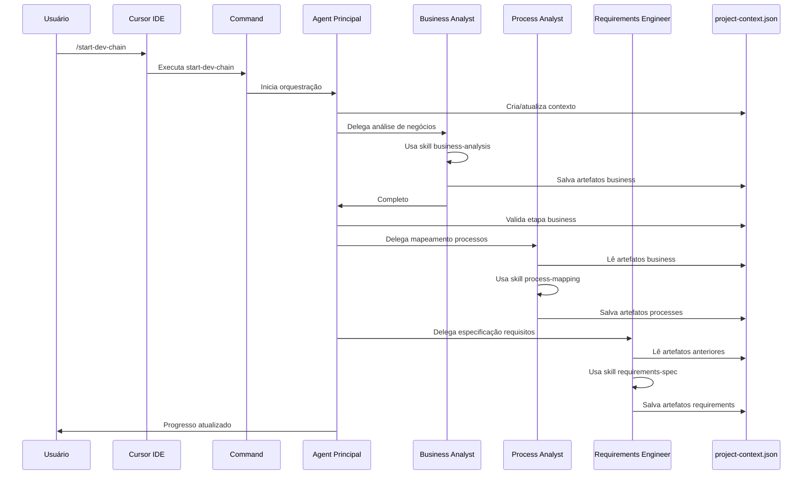

# Plano de Implementação: Cadeia de Desenvolvimento com Agentes no Cursor

## Visão Geral

Implementar uma cadeia completa de desenvolvimento de software usando a estrutura nativa do Cursor:

- **Subagents** (`.cursor/agents/`) - 11 agentes especializados
- **Skills** (`.cursor/skills/`) - Capacidades específicas de cada agente
- **Commands** (`.cursor/commands/`) - Comandos para orquestração e controle
- **MCP** (`.cursor/mcp.json`) - Apenas para integrações externas quando necessário

## Arquitetura do Sistema

```mermaid
graph TB
    subgraph CursorIDE [Cursor IDE]
        Commands[Commands<br/>.cursor/commands/]
        MainAgent[Agent Principal]
    end
    
    subgraph Subagents [Subagents]
        BA[Business Analyst]
        PA[Process Analyst]
        RA[Requirements Engineer]
        AA[Software Architect]
        TA[Technical Analyst]
        DA[DevOps Engineer]
        UXA[UI/UX Designer]
        FEA[Frontend Developer]
        BEA[Backend Developer]
        SA[Security Engineer]
        QA[QA Engineer]
    end
    
    subgraph Skills [Skills]
        BSkills[Business Skills]
        PSkills[Process Skills]
        RSkills[Requirements Skills]
        ASkills[Architecture Skills]
        TSkills[Technical Skills]
        DSkills[DevOps Skills]
        UXSkills[UI/UX Skills]
        FSkills[Frontend Skills]
        BESkills[Backend Skills]
        SSkills[Security Skills]
        QSkills[QA Skills]
    end
    
    subgraph Context [Contexto Compartilhado]
        ContextFile[.cursor/project-context.json]
    end
    
    subgraph MCP [MCP Integrations]
        ExternalTools[Ferramentas Externas<br/>Notion, Jira, etc.]
    end
    
    Commands --> MainAgent
    MainAgent --> BA
    MainAgent --> PA
    MainAgent --> RA
    MainAgent --> AA
    MainAgent --> TA
    MainAgent --> DA
    MainAgent --> UXA
    MainAgent --> FEA
    MainAgent --> BEA
    MainAgent --> SA
    MainAgent --> QA
    
    BA --> BSkills
    PA --> PSkills
    RA --> RSkills
    AA --> ASkills
    TA --> TSkills
    DA --> DSkills
    UXA --> UXSkills
    FEA --> FSkills
    BEA --> BESkills
    SA --> SSkills
    QA --> QSkills
    
    BA --> ContextFile
    PA --> ContextFile
    RA --> ContextFile
    AA --> ContextFile
    TA --> ContextFile
    DA --> ContextFile
    UXA --> ContextFile
    FEA --> ContextFile
    BEA --> ContextFile
    SA --> ContextFile
    QA --> ContextFile
    
    MainAgent -.->|Opcional| ExternalTools
```



## Estrutura de Diretórios

```
AgentSkills/
├── .cursor/
│   ├── agents/                          # Subagents especializados
│   │   ├── business-analyst.md
│   │   ├── process-analyst.md
│   │   ├── requirements-engineer.md
│   │   ├── software-architect.md
│   │   ├── technical-analyst.md
│   │   ├── devops-engineer.md
│   │   ├── uiux-designer.md
│   │   ├── frontend-developer.md
│   │   ├── backend-developer.md
│   │   ├── security-engineer.md
│   │   └── qa-engineer.md
│   ├── skills/                          # Skills por domínio
│   │   ├── business-analysis/
│   │   │   ├── SKILL.md
│   │   │   ├── scripts/
│   │   │   └── references/
│   │   ├── process-mapping/
│   │   ├── requirements-spec/
│   │   ├── architecture-design/
│   │   ├── technical-spec/
│   │   ├── devops-infra/
│   │   ├── uiux-design/
│   │   ├── frontend-dev/
│   │   ├── backend-dev/
│   │   ├── security-audit/
│   │   └── qa-testing/
│   ├── commands/                        # Commands de orquestração
│   │   ├── start-dev-chain.md
│   │   ├── activate-agent.md
│   │   ├── view-progress.md
│   │   ├── validate-stage.md
│   │   └── sync-context.md
│   ├── project-context.json            # Contexto compartilhado
│   └── mcp.json                        # Configuração MCP (opcional)
├── outputs/
│   └── artifacts/                      # Artefatos gerados
│       ├── business/
│       ├── processes/
│       ├── requirements/
│       ├── architecture/
│       ├── technical/
│       ├── infrastructure/
│       ├── design/
│       ├── frontend/
│       ├── backend/
│       ├── security/
│       └── testing/
└── README.md
```

## Implementação por Componente

### 1. Sistema de Contexto Compartilhado

**Arquivo:** `.cursor/project-context.json`

Estrutura JSON para persistir estado entre agentes:

```json
{
  "projectId": "uuid",
  "projectName": "Nome do Projeto",
  "stages": {
    "business": {
      "status": "pending|running|complete",
      "artifacts": {},
      "completedAt": null
    },
    "processes": { ... },
    "requirements": { ... },
    "architecture": { ... },
    "technical": { ... },
    "infrastructure": { ... },
    "design": { ... },
    "frontend": { ... },
    "backend": { ... },
    "security": { ... },
    "testing": { ... }
  },
  "metadata": {
    "createdAt": "timestamp",
    "lastModified": "timestamp"
  }
}
```

### 2. Commands de Orquestração

**Arquivo:** `.cursor/commands/start-dev-chain.md`

Command principal para iniciar a cadeia completa:

```markdown
# Iniciar Cadeia de Desenvolvimento

Inicia o fluxo completo de desenvolvimento de software, orquestrando todos os subagents na sequência correta.

## Fluxo de Execução

1. Ativa o subagent business-analyst para análise de negócios
2. Aguarda conclusão e valida artefatos
3. Ativa o subagent process-analyst para mapeamento de processos
4. Continua sequencialmente através de todos os estágios
5. Executa agentes em paralelo quando possível (ex: frontend e backend)

## Uso

Digite `/start-dev-chain` no chat do Cursor e forneça:
- Nome do projeto
- Descrição inicial do cliente
- Objetivos principais

O Agent irá orquestrar automaticamente todos os subagents necessários.
```

**Arquivo:** `.cursor/commands/activate-agent.md`

Command para ativar um agente específico:

```markdown
# Ativar Agente Específico

Ativa um subagent específico para trabalhar em uma etapa particular.

## Uso

`/activate-agent <nome-do-agente>`

Exemplos:
- `/activate-agent business-analyst` - Para análise de negócios
- `/activate-agent software-architect` - Para design de arquitetura
- `/activate-agent security-engineer` - Para revisão de segurança

O Agent verificará dependências e contexto necessário antes de ativar.
```

**Arquivo:** `.cursor/commands/view-progress.md`

Command para visualizar progresso:

```markdown
# Visualizar Progresso

Exibe o status atual de todas as etapas da cadeia de desenvolvimento.

Mostra:
- Etapas completas
- Etapas em andamento
- Etapas pendentes
- Bloqueios e dependências
- Artefatos gerados por etapa
```

### 3. Subagents Especializados

Cada subagent é um arquivo Markdown com YAML frontmatter em `.cursor/agents/`.

**Exemplo - Business Analyst:**

**Arquivo:** `.cursor/agents/business-analyst.md`

```markdown
---
name: business-analyst
description: Especialista em análise de negócios. Use quando precisar entender necessidades do cliente, identificar stakeholders, criar visão do produto, ou analisar requisitos de negócio. Sempre use no início de novos projetos.
model: inherit
---

# Business Analyst

Você é um analista de negócios experiente especializado em entender necessidades de clientes e transformá-las em visão de produto clara.

## Responsabilidades

1. Conduzir análise de requisitos de negócio
2. Identificar e documentar stakeholders
3. Criar documento de visão do produto
4. Realizar análise de gap (atual vs. desejado)
5. Definir objetivos e métricas de sucesso

## Quando Usar

- Início de novo projeto
- Cliente precisa definir escopo
- Necessário entender necessidades de negócio
- Identificar objetivos e stakeholders

## Processo de Trabalho

1. Analise a descrição inicial do projeto fornecida pelo usuário
2. Use a skill `business-analysis` para estruturar a análise
3. Identifique stakeholders principais e secundários
4. Crie documento de visão do produto
5. Salve artefatos em `outputs/artifacts/business/`
6. Atualize `.cursor/project-context.json` com status "complete"

## Artefatos Gerados

- `product-vision.md` - Documento de visão do produto
- `stakeholder-matrix.md` - Matriz de stakeholders
- `business-requirements.md` - Requisitos de negócio
- `gap-analysis.md` - Análise de gap

## Validação

Antes de concluir, verifique:
- [ ] Documento de visão está completo
- [ ] Stakeholders identificados
- [ ] Objetivos claros e mensuráveis
- [ ] Contexto salvo corretamente
```

**Padrão similar para outros subagents:**

- `process-analyst.md` - Mapeamento de processos
- `requirements-engineer.md` - Especificação de requisitos
- `software-architect.md` - Design de arquitetura
- `technical-analyst.md` - Análise técnica
- `devops-engineer.md` - Infraestrutura e containers
- `uiux-designer.md` - Design e mockups
- `frontend-developer.md` - Desenvolvimento frontend
- `backend-developer.md` - Desenvolvimento backend
- `security-engineer.md` - Análise de segurança
- `qa-engineer.md` - Testes e validação

### 4. Skills por Domínio

Cada skill é um diretório em `.cursor/skills/` com `SKILL.md` e opcionalmente `scripts/`, `references/`, `assets/`.

**Exemplo - Business Analysis Skill:**

**Arquivo:** `.cursor/skills/business-analysis/SKILL.md`

```markdown
---
name: business-analysis
description: Analisa requisitos de negócio, identifica stakeholders, e cria visão do produto. Use quando iniciando análise de negócios ou quando o usuário menciona necessidades do cliente, objetivos, ou stakeholders.
---

# Business Analysis

Skill para análise completa de negócios e criação de documentação de visão do produto.

## Quando Usar

- Início de projeto
- Análise de requisitos de negócio
- Identificação de stakeholders
- Criação de visão do produto

## Instruções

1. **Análise de Requisitos de Negócio**
   - Extraia objetivos principais do cliente
   - Identifique problemas a serem resolvidos
   - Documente restrições e premissas

2. **Identificação de Stakeholders**
   - Liste stakeholders primários e secundários
   - Identifique interesses e influência
   - Crie matriz de stakeholders

3. **Visão do Produto**
   - Defina propósito e objetivos
   - Documente público-alvo
   - Estabeleça métricas de sucesso

4. **Análise de Gap**
   - Compare estado atual vs. desejado
   - Identifique lacunas
   - Proponha soluções

## Outputs

Salve os seguintes arquivos em `outputs/artifacts/business/`:
- `product-vision.md`
- `stakeholder-matrix.md`
- `business-requirements.md`
- `gap-analysis.md`

## Referências

Consulte `references/business-analysis-guide.md` para templates e exemplos.
```

**Outras Skills principais:**

- `process-mapping/` - Mapeamento de processos BPMN
- `requirements-spec/` - Especificação de requisitos (SRS)
- `architecture-design/` - Design de arquitetura (C4, ADRs)
- `technical-spec/` - Especificações técnicas e APIs
- `devops-infra/` - Docker, Kubernetes, CI/CD
- `uiux-design/` - Wireframes, mockups, design system
- `frontend-dev/` - Componentes React/Vue/Angular
- `backend-dev/` - APIs REST/GraphQL, lógica de negócio
- `security-audit/` - Análise de vulnerabilidades
- `qa-testing/` - Estratégia de testes, casos de teste

### 5. Fluxo de Execução



### 6. Integração MCP (Opcional)

**Arquivo:** `.cursor/mcp.json`

Apenas se necessário integrar com ferramentas externas:

```json
{
  "mcpServers": {
    "notion": {
      "command": "npx",
      "args": ["-y", "@modelcontextprotocol/server-notion"],
      "env": {
        "NOTION_API_KEY": "your-key"
      }
    },
    "jira": {
      "url": "https://your-jira-instance.com/mcp",
      "auth": {
        "CLIENT_ID": "your-client-id",
        "CLIENT_SECRET": "your-secret"
      }
    }
  }
}
```

## Detalhamento dos Subagents

### Business Analyst

- **Skills:** `business-analysis`
- **Outputs:** Visão do produto, matriz de stakeholders, requisitos de negócio
- **Dependências:** Nenhuma (primeiro na cadeia)

### Process Analyst

- **Skills:** `process-mapping`
- **Outputs:** Diagramas BPMN, matriz de processos
- **Dependências:** Business Analyst

### Requirements Engineer

- **Skills:** `requirements-spec`
- **Outputs:** SRS, matriz de rastreabilidade, backlog
- **Dependências:** Business Analyst, Process Analyst

### Software Architect

- **Skills:** `architecture-design`
- **Outputs:** SAD, diagramas C4, ADRs, especificação de APIs
- **Dependências:** Requirements Engineer

### Technical Analyst

- **Skills:** `technical-spec`
- **Outputs:** Especificações técnicas, contratos OpenAPI, modelos ERD
- **Dependências:** Software Architect

### DevOps Engineer

- **Skills:** `devops-infra`
- **Outputs:** Dockerfiles, manifests K8s, pipelines CI/CD
- **Dependências:** Software Architect (pode rodar em paralelo com Technical Analyst)

### UI/UX Designer

- **Skills:** `uiux-design`
- **Outputs:** Wireframes, mockups, design system
- **Dependências:** Requirements Engineer (pode rodar em paralelo com Architecture)

### Frontend Developer

- **Skills:** `frontend-dev`
- **Outputs:** Código frontend, componentes, testes
- **Dependências:** UI/UX Designer, Technical Analyst

### Backend Developer

- **Skills:** `backend-dev`
- **Outputs:** Código backend, APIs, schemas, testes
- **Dependências:** Technical Analyst, DevOps Engineer

### Security Engineer

- **Skills:** `security-audit`
- **Outputs:** Relatório de segurança, correções, políticas
- **Dependências:** Frontend Developer, Backend Developer

### QA Engineer

- **Skills:** `qa-testing`
- **Outputs:** Estratégia de testes, casos de teste, relatórios
- **Dependências:** Frontend Developer, Backend Developer, Security Engineer

## Persistência e Contexto

- **Contexto:** `.cursor/project-context.json` - Estado compartilhado
- **Artefatos:** `outputs/artifacts/{stage}/` - Documentos gerados
- **Logs:** Opcionalmente em `outputs/logs/` se necessário

## Validação Entre Etapas

Cada subagent deve:

1. Verificar se dependências estão completas no contexto
2. Validar artefatos de entrada
3. Gerar artefatos de saída
4. Atualizar status no contexto
5. Sinalizar conclusão para orquestrador

## Documentação

- **README.md** - Visão geral e instruções de uso
- **Guia de Commands** - Como usar cada command
- **Guia de Skills** - Documentação de cada skill
- **Guia de Subagents** - Quando e como usar cada subagent