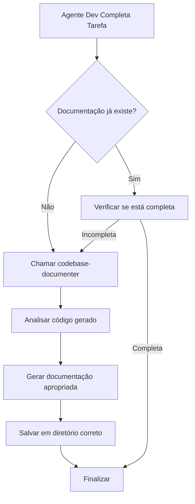

# Plano: Criar Codebase Documenter e Integração com Agentes de Desenvolvimento

## Objetivo

Criar o 12º agente (codebase-documenter) como subagent e skill, integrando-o aos 5 agentes de desenvolvimento para documentação automática após tarefas de geração ou correção de código.

## Estrutura de Arquivos

### 1. Subagent

- **Arquivo:** `.cursor/agents/codebase-documenter.md`
- **Formato:** YAML frontmatter + prompt em português
- **Descrição:** Especialista em documentação de código, APIs, arquitetura e READMEs

### 2. Skill

- **Diretório:** `.cursor/skills/codebase-documenter/`
- **Arquivo principal:** `SKILL.md`
- **Estrutura:**
                                                                                                                                                                                                                                                                                                                                                                                                                                                                                                                                                                                                                                                                                                                                                                                                                                                                                                                                                                                                                                                                                                                                                                                                                                                                                                                                                                                                                                                                                                                                                                                                                                                                                                                                                                                                                                                                                                                                                                                                                                                                                                                                - Baseado no `codebase-documenter/SKILL.md` existente
                                                                                                                                                                                                                                                                                                                                                                                                                                                                                                                                                                                                                                                                                                                                                                                                                                                                                                                                                                                                                                                                                                                                                                                                                                                                                                                                                                                                                                                                                                                                                                                                                                                                                                                                                                                                                                                                                                                                                                                                                                                                                                                                - Adaptado para português e integração com o sistema
                                                                                                                                                                                                                                                                                                                                                                                                                                                                                                                                                                                                                                                                                                                                                                                                                                                                                                                                                                                                                                                                                                                                                                                                                                                                                                                                                                                                                                                                                                                                                                                                                                                                                                                                                                                                                                                                                                                                                                                                                                                                                                                                - Incluir referências aos templates existentes em `codebase-documenter/assets/templates/`
                                                                                                                                                                                                                                                                                                                                                                                                                                                                                                                                                                                                                                                                                                                                                                                                                                                                                                                                                                                                                                                                                                                                                                                                                                                                                                                                                                                                                                                                                                                                                                                                                                                                                                                                                                                                                                                                                                                                                                                                                                                                                                                                - Incluir referências aos guidelines em `codebase-documenter/references/`

### 3. Integração nos Agentes

Atualizar os 5 agentes para chamar o documentador após conclusão:

- **frontend-developer.md** - Adicionar passo de documentação após validação
- **backend-developer.md** - Adicionar passo de documentação após validação
- **uiux-designer.md** - Adicionar passo de documentação após validação
- **devops-engineer.md** - Adicionar passo de documentação após validação
- **security-engineer.md** - Adicionar passo de documentação após validação

## Diretórios de Saída

Documentos gerados devem ser salvos em:

- **Frontend:** `outputs/artifacts/frontend/documentation/`
- **Backend:** `outputs/artifacts/backend/documentation/`
- **Infrastructure:** `outputs/artifacts/infrastructure/documentation/`
- **Design:** `outputs/artifacts/design/` (sem subdiretório, pois design já é documentação)
- **Security:** `outputs/artifacts/security/` (sem subdiretório, pois security já é documentação)

## Tipos de Documentação

1. **Documentação em Código (DocStrings/comentários):**

                                                                                                                                                                                                                                                                                                                                                                                                                                                                                                                                                                                                                                                                                                                                                                                                                                                                                                                                                                                                                                                                                                                                                                                                                                                                                                                                                                                                                                                                                                                                                                                                                                                                                                                                                                                                                                                                                                                                                                                                                                                                                                                                                                                                                                                                                                                                                                                                                                                                                                                                                                                                                                                                                                                                                                                                                                                                                                                                                                                                                                                                                                                                                                                                - Adicionada diretamente no código
                                                                                                                                                                                                                                                                                                                                                                                                                                                                                                                                                                                                                                                                                                                                                                                                                                                                                                                                                                                                                                                                                                                                                                                                                                                                                                                                                                                                                                                                                                                                                                                                                                                                                                                                                                                                                                                                                                                                                                                                                                                                                                                                                                                                                                                                                                                                                                                                                                                                                                                                                                                                                                                                                                                                                                                                                                                                                                                                                                                                                                                                                                                                                                                                - Seguindo padrões do `documentation.md`

2. **Documentação Externa:**

                                                                                                                                                                                                                                                                                                                                                                                                                                                                                                                                                                                                                                                                                                                                                                                                                                                                                                                                                                                                                                                                                                                                                                                                                                                                                                                                                                                                                                                                                                                                                                                                                                                                                                                                                                                                                                                                                                                                                                                                                                                                                                                                                                                                                                                                                                                                                                                                                                                                                                                                                                                                                                                                                                                                                                                                                                                                                                                                                                                                                                                                                                                                                                                                - README.md para módulos/componentes
                                                                                                                                                                                                                                                                                                                                                                                                                                                                                                                                                                                                                                                                                                                                                                                                                                                                                                                                                                                                                                                                                                                                                                                                                                                                                                                                                                                                                                                                                                                                                                                                                                                                                                                                                                                                                                                                                                                                                                                                                                                                                                                                                                                                                                                                                                                                                                                                                                                                                                                                                                                                                                                                                                                                                                                                                                                                                                                                                                                                                                                                                                                                                                                                - API.md para endpoints
                                                                                                                                                                                                                                                                                                                                                                                                                                                                                                                                                                                                                                                                                                                                                                                                                                                                                                                                                                                                                                                                                                                                                                                                                                                                                                                                                                                                                                                                                                                                                                                                                                                                                                                                                                                                                                                                                                                                                                                                                                                                                                                                                                                                                                                                                                                                                                                                                                                                                                                                                                                                                                                                                                                                                                                                                                                                                                                                                                                                                                                                                                                                                                                                - ARCHITECTURE.md para arquitetura
                                                                                                                                                                                                                                                                                                                                                                                                                                                                                                                                                                                                                                                                                                                                                                                                                                                                                                                                                                                                                                                                                                                                                                                                                                                                                                                                                                                                                                                                                                                                                                                                                                                                                                                                                                                                                                                                                                                                                                                                                                                                                                                                                                                                                                                                                                                                                                                                                                                                                                                                                                                                                                                                                                                                                                                                                                                                                                                                                                                                                                                                                                                                                                                                - Guias de uso e configuração

## Fluxo de Integração



## Detalhes de Implementação

### Subagent (`.cursor/agents/codebase-documenter.md`)

**Frontmatter:**

```yaml
name: codebase-documenter
description: Especialista em documentação de código. Use quando precisar documentar código, APIs, arquitetura, criar READMEs, ou adicionar comentários explicativos. Use automaticamente após desenvolvimento de código por frontend-developer, backend-developer, uiux-designer, devops-engineer ou security-engineer.
model: inherit
```

**Conteúdo:**

- Responsabilidades de documentação
- Quando usar (automático após devs + manual)
- Processo de trabalho
- Tipos de documentação (código inline + externa)
- Diretórios de saída por tipo de agente
- Validação de documentação completa

### Skill (`.cursor/skills/codebase-documenter/SKILL.md`)

**Baseado em:** `codebase-documenter/SKILL.md`

**Adaptações:**

- Traduzir para português
- Adicionar seção de integração com agentes
- Especificar diretórios de saída
- Referenciar templates existentes
- Incluir diretrizes de `documentation.md`

### Integração nos Agentes

**Padrão a adicionar em cada agente (após seção "Pós-Desenvolvimento"):**

```markdown
### Documentação

Após concluir o desenvolvimento e validação:

1. **Verificar Necessidade de Documentação**
   - Verifique se a documentação já foi gerada durante o desenvolvimento
   - Identifique componentes/código que precisam de documentação adicional

2. **Chamar Codebase Documenter**
   - Se documentação estiver incompleta ou ausente, chame o subagent `codebase-documenter`
   - Forneça contexto sobre o código gerado e o tipo de documentação necessária
   - O documentador irá:
     - Adicionar DocStrings/comentários no código quando necessário
     - Gerar documentação externa (README, API docs, etc.) quando apropriado
     - Salvar documentos em `outputs/artifacts/{tipo}/documentation/` para frontend/backend/infrastructure, ou `outputs/artifacts/{tipo}/` para design/security

3. **Validar Documentação**
   - Verifique que toda função/classe/componente importante está documentada
   - Confirme que documentação externa foi gerada quando necessário
```

## Arquivos a Criar/Modificar

### Criar:

1. `.cursor/agents/codebase-documenter.md` - Subagent
2. `.cursor/skills/codebase-documenter/SKILL.md` - Skill principal
3. `.cursor/skills/codebase-documenter/references/` - (opcional, pode referenciar os existentes)

### Modificar:

1. `.cursor/agents/frontend-developer.md` - Adicionar seção de documentação
2. `.cursor/agents/backend-developer.md` - Adicionar seção de documentação
3. `.cursor/agents/uiux-designer.md` - Adicionar seção de documentação
4. `.cursor/agents/devops-engineer.md` - Adicionar seção de documentação
5. `.cursor/agents/security-engineer.md` - Adicionar seção de documentação

## Validação

Após implementação, verificar:

- [ ] Subagent pode ser ativado individualmente com `/codebase-documenter`
- [ ] Skill está disponível e funcional
- [ ] Cada agente de dev chama o documentador após tarefas
- [ ] Documentos são salvos nos diretórios corretos
- [ ] Documentação em código (DocStrings) é adicionada quando necessário
- [ ] Documentação externa é gerada nos formatos apropriados