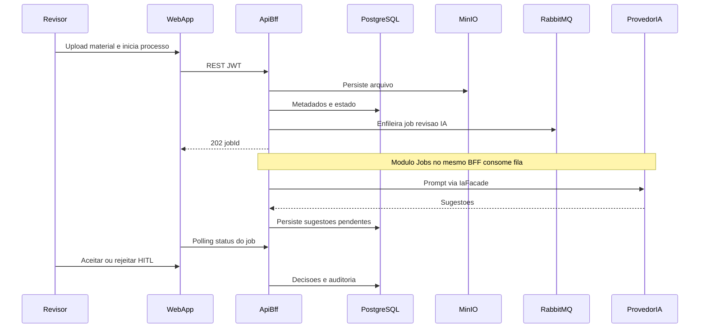

# Documento de Arquitetura de Software (SAD) — SAD-ILA

**Produto:** SAD-ILA — Sistema de Apoio ao Desenvolvimento de Material Didático  
**Projeto:** 26SISIAR05LOG  
**Versão:** 1.0  
**Data:** 2026-10-01  
**Status:** Aceito (Alternativa A — monólito modular + BFF)  
**Audiência:** arquitetura, desenvolvimento, DevOps, segurança, patrocinador técnico ILA/COMGAP  

**Artefatos correlatos:**

| Artefato | Caminho |
|----------|---------|
| Stack tecnológico | `architecture/technology-stack.md` |
| APIs principais | `architecture/api-specification.md` |
| Diagramas C4 | `architecture/c4-diagrams/` |
| ADRs | `architecture/adrs/` |
| SRS | `requirements/srs.md` |

---

## 1. Architecture Haiku

```
SAD-ILA: o revisor decide.
Um BFF modular, JWT na borda.
IA sugere; a fila espera.
Arquivos no MinIO; trilha no Postgres.
```

---

## 2. Visão e escopo

### 2.1 Propósito

O SAD-ILA é plataforma **web** para a Seção de Material Didático do ILA: gestão de cursos e materiais, processo de revisão **human-in-the-loop** (HITL) com IA, conferência do Quadro Estrutural (QE), relatórios/exportações e histórico auditável.

Alinha-se a ON-01–ON-04 e OP-01–OP-05 (`business/product-vision.md`).

### 2.2 Escopo arquitetural v1

**Incluído (desenho alvo, entregue por fases MVP → F3):**

- Frontend Next.js consumindo **somente** a API REST do BFF.
- Backend NestJS **monólito modular** (BFF + Facade de IA + consumidor de fila no **mesmo deploy**).
- PostgreSQL (transacional + auditoria), MinIO (objetos), RabbitMQ (jobs IA/export).
- Autenticação local e-mail/senha + JWT; RBAC mínimo (`revisor`, `admin_cursos`, `admin_sistema`).
- Feature flag **G-09** para desabilitar RF-040 em produção até decisão institucional.

**Excluído v1 (explícito no SRS):**

- LMS, SSO COMAER (F4 / RF-W01), publicação automática sem HITL, edição colaborativa em tempo real, contêiner **worker** separado.

### 2.3 Princípios aplicados

Fonte: `.cursor/skills/architecture-design/references/orientacoes-arquiteturais.md`.

| Princípio | Como se manifesta neste SAD |
|-----------|-----------------------------|
| **Foco no valor de negócio** | Arquitetura mínima para MVP (E1–E2) com ganchos para F2 (IA) sem reescrita |
| **Evolvabilidade** | Módulos por domínio; Facade de IA substituível; worker extraível depois |
| **Agilidade / entrega contínua** | Um backend, um frontend, Compose local; contratos `/api/v1` |
| **Qualidade e manutenibilidade** | Baixo acoplamento entre módulos; OpenAPI; testes Jest/Playwright |
| **Decisões orientadas a dados** | Carga de piloto (abaixo) justifica monólito; microsserviços rejeitados |

---

## 3. Drivers arquiteturais

### 3.1 Funcionais (Must que moldam o desenho)

| Driver | RF | Implicação |
|--------|-----|------------|
| HITL obrigatório | RF-040–042, RFN-060 | Nenhuma escrita no `.docx` sem decisão persistida |
| Facade/proxy de IA | RF-090, RFN-041 | Frontend **nunca** chama provedor de IA |
| Fluxo sequencial | RF-044, RF-053, RF-080 | Máquina de estados no BFF; UI não pula etapas |
| Uploads Word/PDF | RF-020, RF-031 | Object storage + validação MIME no BFF |
| Auditoria append-only | RF-070, RFN-007 | Eventos imutáveis no PostgreSQL |
| Auth JWT + RBAC | RF-001–005 | Tabela `auth_users` dedicada; checagem em toda rota mutável |

### 3.2 Não funcionais Must

RFN-001 (segredos), RFN-002 (JWT/HTTPS), RFN-003 (hash senha), RFN-004 (RBAC), RFN-005 (isolamento storage), RFN-006 (CORS), RFN-010 (limites), RFN-020 (Docker), RFN-030 (responsivo), RFN-040 (OpenAPI), RFN-041 (BFF), RFN-043 (testes), RFN-050 (estratégia de renderização), RFN-060 (HITL).

### 3.3 Restrições de plataforma

- Ambiente Windows + **Docker Desktop** (`.cursor/rules/ambiente.mdc`).
- `TODOs.md`: Node.js, JWT, SHA256 v1, OpenAPI, CORS, BFF/Facade.
- Stacks atuais: Next.js, NestJS, PostgreSQL, MinIO, RabbitMQ, Ollama, Docker.

### 3.4 Lacunas que **não** são inventadas aqui

| Lacuna | Impacto arquitetural | Tratamento |
|--------|----------------------|------------|
| G-09 / V-03 provedor e política de IA | Produção com material real | Feature flag; ADR-008 **Proposta** para provedor de produção |
| V-02 classificação de sigilo | O que pode ir à IA | Flag desliga RF-040 até aprovação |
| V-04 SSO COMAER | Identidade | Auth local v1; ADR-006 registra evolução F4 |
| V-05 tamanho máximo arquivo | Default 50 MB via env | Validar com TI |
| Baseline M-01 métricas | SLA de IA | Timeout 180s configurável; calibrar no piloto |

---

## 4. Estimativa de escala (back-of-the-envelope)

Premissas de **piloto** (não são SLA institucional; volumes reais são lacuna G-10):

| Grandeza | Ordem de magnitude | Fonte |
|----------|--------------------|--------|
| Usuários concorrentes | dezenas (Seção MD, não alunos) | product-vision §1.4 |
| Cursos | até **500** | RFN-010 |
| Materiais / curso | até **20** | RFN-010 |
| Upload | até **50 MB**/arquivo; 20 MB em 120s | RFN-010 |
| Job IA | timeout **180 s**; documentos longos assíncronos | RFN-011 |
| Listagens | p95 **< 2 s** | RFN-010 |

**Conclusão:** um BFF NestJS + PostgreSQL indexado atende listagens. Jobs de IA **não** devem bloquear o event loop HTTP — fila RabbitMQ + consumidor no mesmo processo (prefetch limitado) é suficiente. Split de worker (Alternativa B) só se métricas de piloto mostrarem contenção (CPU/timeout vs. latência de API).

Cálculo ilustrativo: 10 revisores × 1 job IA simultâneo × 180 s ≈ pico de 10 chamadas longas. Prefetch 1–2 no consumidor evita saturar Ollama/provedor. Memória do BFF: ordem de centenas de MB + buffers de upload (limitar `MAX_UPLOAD_MB`).

---

## 5. Arquitetura adotada — Alternativa A (monólito modular + BFF)

### 5.1 Visão geral

Um **único deploy de backend** (NestJS) organiza o domínio em módulos com fronteiras claras. O frontend (Next.js) é cliente HTTP/JWT. Persistência relacional, objetos e mensageria são contêineres satélites. O módulo **Jobs** consome RabbitMQ **no mesmo processo** da API.

Alinha-se a **Modular Monolith** (orientações §2.1) e a **camadas internas por módulo** (evitar Architecture Sinkhole: controllers finos, application services, persistência). Comunicação síncrona na borda HTTP; **assíncrona** só para IA e export pesado (EDA localizada, não sistema event-driven global).

### 5.2 Contêineres (deploy v1)

| Contêiner | Responsabilidade |
|-----------|------------------|
| **WebApp** | Next.js — UI, rotas, token efêmero; sem persistência de documentos |
| **ApiBff** | NestJS — REST `/api/v1`, RBAC, facades, consumidor de fila |
| **PostgreSQL** | Auth, catálogo, processos, sugestões, QE, auditoria |
| **MinIO** | `.docx`/PDF originais e gerados; chaves UUID |
| **RabbitMQ** | Filas `revisao.ia` e `export.documento` |
| **ProvedorIA** | Ollama (dev/piloto on-prem) ou endpoint configurável; **somente** o BFF acessa |

Reverse proxy (nginx/Traefik) é **opcional** em dev (Compose expõe portas); em produção COMGAP recomenda-se TLS na borda (RFN-002). Detalhe visual: `c4-diagrams/02-containers.md`.

### 5.3 Fluxo ponta a ponta (revisão F2)



Gate: se `AI_ENABLED=false` (G-09), o BFF **não** enfileira job de IA e o processo segue política de UX (mensagem institucional / critérios QE apenas).

### 5.4 Módulos de domínio (ApiBff)

Fronteiras alinhadas a processos P-ACC, P-CUR, P-MAT, P-REV, P-QE, P-ENC, P-GOV, P-TI-03.

| Módulo | Responsabilidade | Não faz |
|--------|------------------|---------|
| **Auth** | Login, JWT, logout/denylist, `auth_users` | Perfil pedagógico de curso |
| **Users** | Provisionamento `admin_sistema` | Autenticação (delega Auth) |
| **Cursos** | CRUD curso, listagem, hub | Arquivos binários |
| **Materiais** | Metadados de apoio, upload/download curso | Processo de revisão |
| **ProcessoRevisao** | Máquina de estados, preparação, critérios, avanço de etapa | Chamada direta à IA |
| **IaFacade** | Adapter de provedor, prompts, mapeamento de sugestões, circuit breaker/timeout | Persistência de decisão HITL |
| **Jobs** | Publish/consume AMQP, retry, status de job | Regras de negócio de revisão |
| **QeConferencia** | Parse QE, matriz, itens, conclusão | Export PDF |
| **Relatorios** | Agregados UI, geração docx/pdf via job | Auth |
| **Storage** | Cliente MinIO, paths isolados, validação MIME | Regras de estado do processo |
| **Auditoria** | Append-only de eventos de negócio | Conteúdo integral do Word nos logs |

Dependências permitidas: ProcessoRevisao → Storage, Auditoria, Jobs; Jobs → IaFacade, ProcessoRevisao, Relatorios; **nenhum** módulo de domínio importa o frontend. Frontend **não** orquestra MinIO nem IA.

Estados do processo (SRS §4.1): `rascunho` → `preparacao_concluida` → `revisao_ia` → `qe` → `relatorio` → `concluido`. Transições só no BFF (RN-023).

### 5.5 Camadas internas de um módulo

```
Controller (HTTP) → Application Service → Domain + Ports
                         ↓
              TypeORM/Prisma Repository    Adapters (MinIO, AMQP, IA)
```

Evitar camadas puramente pass-through. DTOs de API ≠ entidades de persistência.

### 5.6 Conway / organização

Um time Scrum multidisciplinar (frontend + backend + dados) opera o monólito. Carga cognitiva aceitável para piloto. Extração de worker ou de módulo IA no futuro não exige reorganização imediata de times.

---

## 6. Atributos de qualidade

### 6.1 Escalabilidade e elasticidade

- Scale-out horizontal do **ApiBff** (stateless JWT; denylist em Postgres). Consumidor AMQP: concorrência via prefetch; em um único replica v1, limitar workers internos.
- Listagens paginadas + índices (`curso_id`, `processo_id`, `created_at`).
- Cache **não** é Must no piloto; Redis (stack atual) fica como opção se p95 > 2 s.
- Uploads não passam pelo frontend como storage; stream BFF → MinIO.

### 6.2 Resiliência

| Tática | Onde |
|--------|------|
| Timeout | `AI_REQUEST_TIMEOUT_MS` (default 180000); HTTP client da Facade |
| Retry | Jobs AMQP com backoff limitado; **não** retry cego em 4xx |
| Circuit breaker | IaFacade abre circuito após N falhas; processo fica recuperável (RF-091) |
| Bulkhead lógico | Prefetch baixo na fila IA para não esgotar event loop HTTP |
| Health | `/health` liveness; `/ready` exige Postgres (+ RabbitMQ/MinIO Should) |

Falha de IA: estado do processo permanece; UI oferece retry; evento de auditoria.

### 6.3 Segurança (por design)

- Segredos só em `.env` / env do container (RFN-001). Frontend sem chaves de IA.
- JWT HS256/RS256 via env; claims `sub`, `email`, `roles`, `iat`, `exp`; TTL ~8h (RFN-002).
- Hash SHA256+salt/pepper v1 (dívida ADR-007 → Argon2/bcrypt antes de produção institucional).
- CORS `CORS_ORIGINS`; OpenAPI `/api/docs` sem expor admin sem auth.
- Downloads: UUID + checagem RBAC; prefixo MinIO `cursos/{cursoId}/...` e `processos/{processoId}/...`.
- Logs: sem senha, token completo ou corpo de documento.

**STRIDE (resumo):**

| Ameaça | Mitigação v1 |
|--------|----------------|
| Spoofing | JWT assinado; credenciais hashed; login genérico |
| Tampering | Originais imutáveis no MinIO; auditoria append-only; HITL para docx final |
| Repudiation | Eventos com `user_id`, timestamp UTC, `processo_id` |
| Information disclosure | Storage autenticado; G-09; Facade não vaza chaves |
| Denial of service | Limites de upload; timeout IA; prefetch |
| Elevation of privilege | RBAC em toda mutação e download |

Zero Trust na borda: cada request autentica; BFF não confia no cliente para papel.

### 6.4 Desempenho

- APIs de listagem: consultas projetadas (sem N+1), paginação.
- Wizard/HITL: client-side para interatividade; dados via REST.
- Geração docx/pdf: assíncrona (202 + polling).
- Gargalo esperado: provedor de IA, não o RDBMS no piloto.

### 6.5 Evolvabilidade e manutenibilidade

- Contrato `/api/v1` + OpenAPI (RFN-040).
- IaProvider interface: Ollama agora; outro adapter sem mudar controllers.
- Dívida deliberada: SHA256 (ADR-007); consumidor no mesmo processo (ADR-001/009).
- Testes: Jest no container; Playwright E2E (login, curso, iniciar revisão, aceitar sugestão F2+).

---

## 7. Integrações

| Integração | Protocolo | Dono | Notas |
|------------|-----------|------|-------|
| Frontend ↔ BFF | HTTPS REST JSON, Bearer JWT | ApiBff | Única API pública de negócio |
| BFF ↔ PostgreSQL | TCP ORM | ApiBff | Rede interna Compose |
| BFF ↔ MinIO | S3 API | Storage | Credenciais só no backend |
| BFF ↔ RabbitMQ | AMQP | Jobs | Filas duráveis |
| BFF ↔ Provedor IA | HTTPS REST (Ollama `/api/chat` ou equivalente) | IaFacade | Feature flag; TLS se externo |

Não há integração LMS nem IdP COMAER na v1.

---

## 8. Estratégia de renderização (RFN-050)

Fonte obrigatória: `TODOs.md` § Frontend. Detalhe e justificativa: ADR-002.

| Rota | Estratégia | Justificativa |
|------|------------|---------------|
| `/login` | SSG + hidratação cliente | Página estática; SEO irrelevante (intranet) |
| `/cursos` | Client + SWR | Lista autenticada, dados frescos |
| `/cursos/[id]` | Client + SWR | Hub dinâmico (materiais, ações) |
| `/revisao/novo` | Client | Entrada de wizard, estado de formulário |
| `/revisao/[processoId]/preparacao` | Client (SPA shell) | Wizard multi-step |
| `/revisao/[processoId]/sugestoes` | Client | HITL, polling de job |
| `/revisao/[processoId]/qe` | Client | Matriz editável |
| `/revisao/[processoId]/relatorio` | Client + SWR | Agregados pós-QE |
| `/historico` | Client + SWR | Listagem paginada |
| `/admin/usuarios` | Client + SWR | CRUD autenticado `admin_sistema` |

SSR pleno das rotas autenticadas **não** é necessário: não há SEO público e sessão é JWT no cliente. Next.js permanece na stack para SSG do login, App Router e evolução SSR se COMGAP exigir.

Frontend **não persiste** documentos (sem IndexedDB de arquivos); apenas token efêmero e estado de UI.

---

## 9. Rastreabilidade RF/RFN → módulos

| Função / RF | Módulos BFF | Contêineres |
|-------------|-------------|-------------|
| RF-001–005 | Auth, Users | ApiBff, PostgreSQL, WebApp |
| RF-010–012 | Cursos | ApiBff, PostgreSQL, WebApp |
| RF-020–022 | Materiais, ProcessoRevisao, Storage | ApiBff, MinIO, PostgreSQL |
| RF-030–035 | ProcessoRevisao, Storage | ApiBff, MinIO |
| RF-040–044, RF-090–091 | IaFacade, Jobs, ProcessoRevisao | ApiBff, RabbitMQ, ProvedorIA |
| RF-050–053 | QeConferencia | ApiBff, PostgreSQL, MinIO |
| RF-060–063 | Relatorios, Jobs | ApiBff, MinIO, RabbitMQ |
| RF-070–071 | Auditoria, ProcessoRevisao | PostgreSQL |
| RF-080–081 | — (WebApp) | WebApp |
| RFN-001–006 | Auth, Storage, config | todos |
| RFN-010–011 | Storage, Jobs, IaFacade | ApiBff, RabbitMQ, MinIO |
| RFN-020 | — | Docker Compose (DevOps) |
| RFN-040–041 | todos os controllers | ApiBff |
| RFN-050 | — | WebApp |
| RFN-060 | ProcessoRevisao, Relatorios | ApiBff |

Matriz RN↔RF completa: `requirements/requirements-traceability-matrix.md`.

---

## 10. Plano de evolução

| Fase | Arquitetura |
|------|-------------|
| **MVP (E0–E2)** | Auth, Cursos, Materiais, iniciar processo (rascunho), Docker, OpenAPI; IA **desligada** se G-09 pendente |
| **F2 (E3–E4, E7)** | Wizard, IaFacade, Jobs, HITL, auditoria |
| **F3 (E5–E6)** | QE, relatórios, export docx/pdf |
| **F4** | SSO (ADR-006); WCAG pleno; possível extração de **worker** se piloto exigir (Alternativa B) |
| **Pós-estabilização** | Extração de bounded contexts só com times e carga que justifiquem (Alternativa C) |

Split worker **fora do escopo v1**. Mesmos módulos e contratos HTTP; mudança seria operacional (novo contêiner consumindo as mesmas filas).

---

## 11. Dívida técnica deliberada

| Item | ADR | Plano de pagamento |
|------|-----|-------------------|
| Hash SHA256 de senha | ADR-007 | Migrar Argon2id ou bcrypt **antes** de produção institucional |
| Consumidor AMQP no mesmo processo | ADR-001, ADR-009 | Extração worker se contenção medida |
| Refresh token ausente | RFN-002 Could | v1.1 se sessão de 8h for insuficiente |
| Anti-malware de upload | RFN-005 Could | ClamAV ou equivalente COMGAP |

---

## 12. Apêndice — alternativas consideradas

Estrutura conforme `guia-alternativas-arquiteturais.md`. **A é adotada**; B e C não geram diagrama de deploy v1.

### 12.1 Alternativa A — Monólito modular + BFF (adotada)

- **Visão:** descrita nas seções 5–8.
- **Alinhamento requisitos:** cobre RF/RFN Must com menor superfície operacional (RFN-020).
- **Alinhamento orientações:** §2.1 ponto de partida recomendado; EDA apenas onde RFN-011 exige.
- **Atributos:** escala de piloto ok; resiliência via fila+timeout; segurança BFF; evolui para B sem reescrever domínio.

### 12.2 Alternativa B — Core + AI Worker (rejeitada v1)

- **Visão:** mesmo código de módulos, mas **segundo contêiner** consome `revisao.ia` / `export.documento` (bulkhead de processo).
- **Prós:** isolamento de CPU/timeouts longos; scale independente do HTTP.
- **Contras:** Compose e operação extras no Docker Desktop; dois deploys para time único; benefício não demonstrado pela carga de piloto.
- **Quando revisitar:** p95 de API degradado durante jobs IA, ou Ollama saturando o BFF.

### 12.3 Alternativa C — Microsserviços por bounded context (rejeitada piloto)

- **Visão:** Auth, Catalog, Review, Reporting como serviços com APIs próprias, possivelmente fila entre eles.
- **Prós:** autonomia de times, escala granular (orientações §2.2).
- **Contras:** complexidade distribuída (sagas, consistência, observabilidade) incompatível com um time e domínio ainda em formação (G-09, SSO aberto); piora time-to-market do MVP.
- **Quando revisitar:** múltiplos times stream-aligned e volume institucional acima do piloto.

### 12.4 Matriz comparativa

| Critério | A (adotada) | B | C |
|----------|-------------|---|---|
| Fit MVP/F2 | Alto | Médio (ops+) | Baixo |
| Complexidade operacional | Baixa | Média | Alta |
| Resiliência a jobs longos | Média (prefetch) | Alta | Alta se bem feito |
| Evolvabilidade | Alta (módulos) | Alta | Alta com custo |
| Curva de aprendizado | Alinhada à stack | Idem + worker | Distribuição |
| Custo cognitivo (Conway) | 1 time | 1 time, 2 runtimes | Vários times |
| Risco de over-engineering | Baixo | Médio | Alto |

**Decisão:** Alternativa A. Registrada em ADR-001.

---

## 13. Referências

- `requirements/srs.md`, `functional-requirements.md`, `non-functional-requirements.md`
- `business/product-vision.md`, `business/gap-analysis.md`
- `processes/critical-processes-matrix.md`
- `TODOs.md`
- Orientações e stacks em `.cursor/skills/architecture-design/references/`

### Histórico

| Versão | Data | Notas |
|--------|------|-------|
| 1.0 | 2026-10-01 | Arquitetura inicial — Alternativa A aceita |
