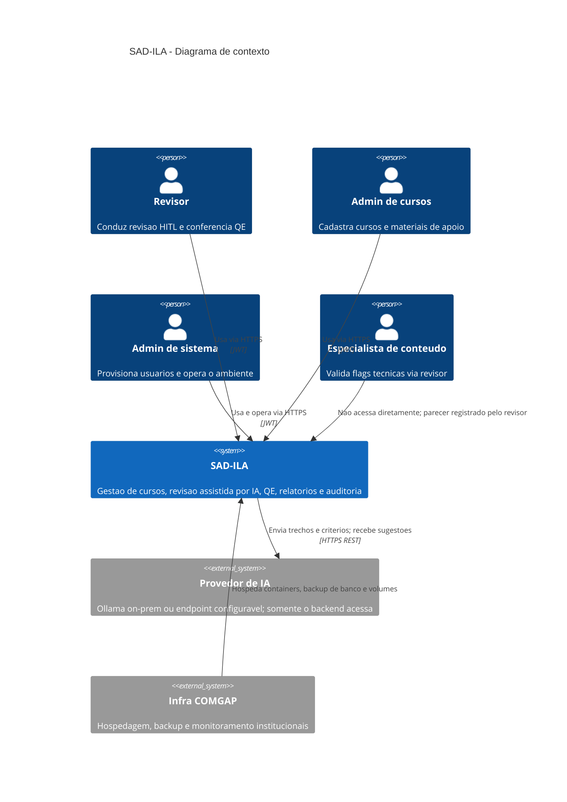

# C4 — Nível 1: Contexto

**Sistema:** SAD-ILA  
**Objetivo:** situar usuários e sistemas externos. O frontend não aparece neste nível (está dentro do SAD-ILA).

## Diagrama

## Atores

| Ator | Relação com o SAD-ILA |
|------|------------------------|
| Revisor | Fluxo completo de revisão (P-REV, P-QE, P-ENC) |
| Admin de cursos | Catálogo e materiais (P-CUR, P-MAT) |
| Admin de sistema | Usuários e saúde do sistema (P-TI-01/02) |
| Especialista | Sem login dedicado v1; interação via flag RF-043 |
| Provedor de IA | Sistema externo; **gate G-09** para material real |
| Infra COMGAP | Operação; RPO/RTO não inventados (RFN-022) |

Alunos dos cursos **não** são usuários do sistema (visão do produto §1.4).
