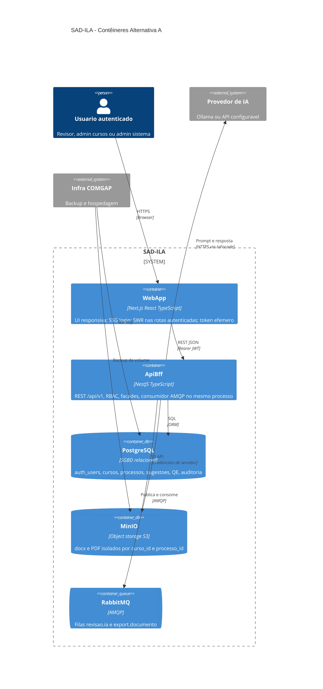

# C4 — Nível 2: Contêineres (Alternativa A)

**Escopo:** único desenho de deploy da v1. O ApiBff **inclui** o consumidor de fila. Reverse proxy TLS é nota de produção, não contêiner obrigatório em dev.

## Diagrama

## Fluxos fundamentais

1. **UI → API:** o WebApp não fala com MinIO, Postgres, RabbitMQ nem IA.
2. **Upload:** ApiBff valida MIME/tamanho, grava MinIO, metadados no PostgreSQL.
3. **Job IA:** ApiBff publica na fila; o **mesmo** processo consome, chama IaFacade, persiste sugestões.
4. **HITL:** decisões só no PostgreSQL; geração de docx final é outro job.

## Contêineres e requisitos

| Contêiner | RF / RFN principais |
|-----------|---------------------|
| WebApp | RF-080, RFN-050 |
| ApiBff | RF-001–091, RFN-001–006, 040–041 |
| PostgreSQL | RFN-003, RF-070 |
| MinIO | RFN-005, RF-020, RF-031 |
| RabbitMQ | RFN-011, RF-090 |
| Provedor IA | RF-040, RFN-008 |

## Nota de produção

HTTPS termina em reverse proxy ou load balancer COMGAP (não desenhado como contêiner v1 de desenvolvimento). Compose local pode expor `web:3000` e `api:3001` em HTTP documentado (RFN-002).
