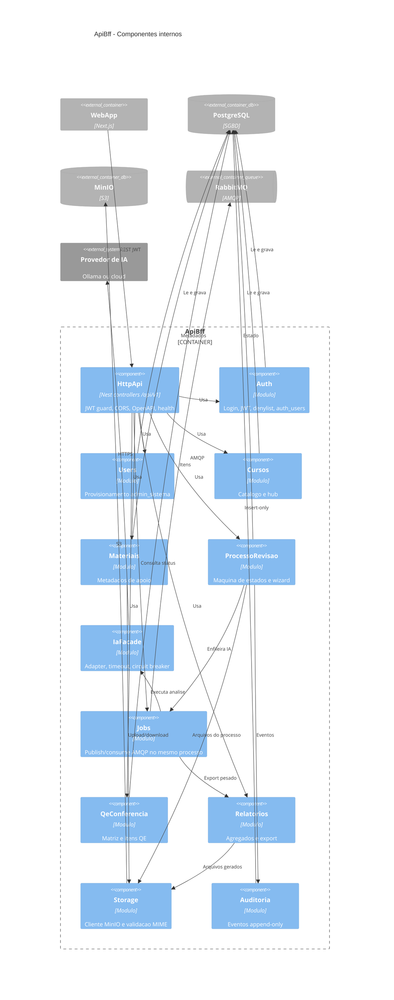

# C4 — Nível 3: Componentes do ApiBff

**Contêiner:** ApiBff (NestJS)  
**Estilo interno:** módulos de domínio + adapters. Sem diagrama de classes (nível Código omitido).

## Diagrama

## Regras de dependência

- **HttpApi** não contém regra de negócio além de validação de DTO e guards.
- **ProcessoRevisao** não chama o provedor de IA diretamente — apenas **Jobs** + **IaFacade**.
- **IaFacade** é o único componente que conhece URL/chave do provedor (env).
- **Auditoria** não atualiza linhas históricas.
- **Storage** não interpreta critérios de revisão.

## Mapeamento para User Stories (resumo)

| Módulo | US |
|--------|-----|
| HttpApi, health | US-002, US-003, US-007 |
| Auth, Users | US-001, US-004–006 |
| Cursos, Materiais | US-008–012 |
| ProcessoRevisao | US-013, US-020–024, US-028 |
| IaFacade, Jobs | US-025, US-026 |
| HITL via Processo + HTTP | US-027, US-029 |
| QeConferencia | US-030–032 |
| Relatorios | US-034–036 |
| Auditoria | US-037, US-038 |
