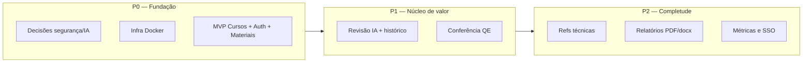

# Análise de Gap — SAD-ILA

**Produto:** SAD-ILA  
**Data:** 2026-10-01  
**Versão:** 1.0  

---

## 1. Objetivo da análise

Comparar o **estado atual (as-is)** da capacidade de revisão e gestão de material didático no ILA com o **estado desejado (to-be)** representado pela visão do produto, protótipo de referência e requisitos de negócio, identificando lacunas, impactos e priorização de fechamento.

---

## 2. Estado atual (As-Is)

| Dimensão | Situação observada | Evidência / nota |
|----------|-------------------|------------------|
| **Sistema de software** | Não há aplicação implementada neste repositório; apenas **protótipo estático HTML** (`others_artifacts/sad-ila-prototype 1.3.html`) demonstrando jornada desejada. | Gap total de produção |
| **Gestão de cursos** | Processo presumivelmente **manual** (planilhas, pastas compartilhadas ou ferramentas genéricas) — **não documentado** nas fontes. | Lacuna — validar com Process Analyst |
| **Armazenamento de materiais** | Upload/consulta não centralizados em sistema dedicado SAD-ILA. | Inferido da necessidade em visao-inicial |
| **Revisão textual** | Revisão **manual** por revisor humano; sem assistência sistemática de IA integrada ao fluxo. | Protótipo descreve to-be |
| **Conferência QE** | Confronto QE ↔ material feito **manualmente** (leitura cruzada, checklists possivelmente em Word/Excel). | Protótipo QE |
| **Referências técnicas** | Confronto normativo **manual**; sem engine unificada de citação/conformidade automatizada. | Protótipo |
| **Relatórios** | Produção manual de relatórios de revisão; sem padronização automática de métricas (sugestões aceitas, itens QE parciais, etc.). | Protótipo relatório |
| **Rastreabilidade** | Histórico possivelmente fragmentado (e-mail, controle de versão de arquivos, comentários Word) — **sem trilha única**. | Protótipo cita rastreabilidade como requisito |
| **Autenticação / segurança** | Sem plataforma dedicada; políticas COMAER aplicáveis mas **não mapeadas** neste repositório. | TODOs.md define to-be técnico |
| **Legacy** | Pasta `legacy/` **inexistente** — sem inventário de sistema anterior. | Não aplicável |

---

## 3. Estado desejado (To-Be)

| Dimensão | Capacidade alvo |
|----------|-----------------|
| **Plataforma web** | Auth segura → painel de cursos responsivo |
| **Cadastro** | Cursos (título, descrição) e materiais de apoio por curso |
| **Revisão** | Fluxo guiado: seleção de curso, uploads (QE, material Word, refs.), critérios configuráveis |
| **IA** | Sugestões categorizadas, explicadas, **sem auto-aplicação**; decisão do revisor |
| **QE** | Matriz de correspondência com status e hierarquia |
| **Saídas** | Relatório consolidado; download docx revisado e PDFs |
| **Governança** | Histórico completo por processo (quem, quando, o quê decidiu) |
| **Arquitetura** | Frontend + Backend (BFF), persistência, IA via backend, containers Docker |
| **Segurança** | JWT, hash de senha (SHA256 conforme TODOs — validar adequação vs. bcrypt em RFN), secrets em `.env` |

Referência: `product-vision.md`, `business-requirements.md`.

---

## 4. Gap analysis consolidado

| # | Lacuna | As-Is | To-Be | Impacto | Solução proposta | Prioridade |
|---|--------|-------|-------|---------|------------------|------------|
| **G-01** | Ausência de sistema productizado | Protótipo HTML | Aplicação full-stack | **Crítico** — bloqueia valor | Implementar SAD-ILA conforme cadeia de agentes | P0 |
| **G-02** | Gestão centralizada de cursos/materiais | Disperso / manual | RN-001 a RN-004 | **Alto** — base operacional | Módulo de cursos + storage de anexos | P0 (MVP) |
| **G-03** | Autenticação e controle de acesso | Não unificado | RN-005, RN-006, JWT | **Alto** — segurança institucional | Login + RBAC mínimo; evoluir SSO | P0 |
| **G-04** | Revisão textual assistida | Manual | RN-013 a RN-016 | **Alto** — principal diferencial | Integração IA + UI de sugestões | P1 |
| **G-05** | Conferência QE sistemática | Manual | RN-017 a RN-019 | **Alto** — qualidade estrutural | Pipeline de parsing QE/material + regras IA/heurísticas | P1 |
| **G-06** | Confronto com referências técnicas | Manual | RN-011, RN-012 | **Médio** | Indexação/refs + prompts IA | P2 |
| **G-07** | Relatórios e exportações padronizadas | Manual | RN-020 a RN-022 | **Médio** — entregável oficial | Geração docx/pdf server-side | P2 |
| **G-08** | Rastreabilidade auditável | Fragmentada | RN-024, RN-025 | **Alto** — compliance | Event sourcing ou log de processo imutável | P1 |
| **G-09** | Política de dados / IA | Indefinida | Hospedagem segura | **Crítico** se material sensível | ADR + opção on-prem; anonimização | P0 (decisão) |
| **G-10** | Baseline de métricas (tempo, qualidade) | Não medido | M-01 a M-06 | **Médio** — provar ROI | Medir processo manual antes/durante piloto | P1 |
| **G-11** | Processos BPM formais | Não documentados no repo | Fluxo to-be claro | **Médio** — alinhamento organizacional | Process Analyst (`processes/`) | P1 |
| **G-12** | Design system / UX institucional | Só protótipo HTML | RN-026, RN-027 | **Médio** | UI/UX a partir do protótipo | P1 |
| **G-13** | Infraestrutura containerizada | Inexistente | Docker compose | **Alto** — entrega | DevOps Engineer | P0 |
| **G-14** | Documentação de API | N/A | OpenAPI pública | **Médio** | Backend conforme TODOs.md | P1 |

---

## 5. Gap entre visões de escopo (visao-inicial vs. protótipo)

| Aspecto | visao-inicial.txt | Protótipo 1.3 | Resolução proposta |
|---------|-------------------|---------------|-------------------|
| Profundidade da revisão | “Iniciar Revisão” (macro) | Fluxo completo IA + QE + PDFs | MVP entrega cursos/materiais + início; fases 2–3 fecham protótipo |
| QE e referências | Não citados | Centrais | Should/Must conforme RN-010+ |
| Painel | “Painel principal de cursos” | Navegação Materiais / Revisão IA / QE | Unificar: cursos como hub |

**Gap de comunicação:** alinhar com patrocinador se MVP pode ser apenas gestão + upload ou se piloto exige IA desde o dia 1.

---

## 6. Lacunas de informação (impedem fechamento de gap)

1. **Classificação de sigilo** dos materiais didáticos e impacto no uso de IA em nuvem.
2. **Processo as-is** detalhado (tempos, ferramentas, papéis).
3. **Volume** e tamanho máximo de arquivos Word/QE.
4. **Provedor de IA** aprovado pela instituição.
5. **Integração SSO** COMAER — obrigatória ou desejável na v1.
6. **Sistema legado** — pasta `legacy/` ausente.

---

## 7. Roadmap de fechamento (proposta)

---

## 8. Riscos associados aos gaps

| Gap | Risco se não tratado |
|-----|---------------------|
| G-09 | Vazamento ou uso indevido de conteúdo sensível |
| G-04 / G-05 | Expectativa frustrada se IA/QE forem imprecisos — perda de confiança |
| G-08 | Impossibilidade de auditoria em material oficial |
| Escopo MVP vs. protótipo | Atraso ou cancelamento por entrega percebida incompleta |

---

## 9. Critérios de sucesso do fechamento de gap

- Piloto com revisores reais concluindo ao menos um fluxo ponta a ponta (definir se MVP ou fase 3).
- 100% dos processos piloto com histórico RN-024 satisfatório.
- Aprovação de TI/Segurança para modelo de deployment e IA (G-09).
- Redução mensurável do tempo de ciclo (M-01) ou justificativa documentada se baseline ainda não existir.

---

## 10. Próximos passos na cadeia de agentes

1. **Process Analyst** — documentar processo as-is/to-be em BPMN (`processes/`).
2. **Requirements Engineer** — SRS, RFN (segurança, JWT, `.env`), user stories Ready for Dev.
3. Validação com stakeholders ILA/COMGAP das lacunas da seção 6.
