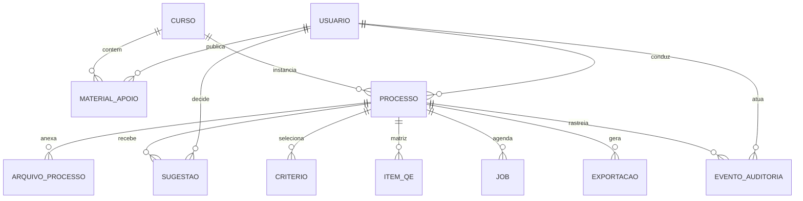

# Modelo de dados — SAD-ILA

**Versão:** 1.0  
**Data:** 2026-10-01  
**SGBD:** PostgreSQL 16 (Alpine em dev)  
**DDL:** `data/migrations/001_initial_schema.sql`  
**ERD (Technical Analyst):** `technical/data-models/erd.md`  
**Rastreio:** RF-001–005, RF-010–012, RF-020–021, RF-030–035, RF-040–043, RF-050–053, RF-061–062, RF-070, RFN-003, RFN-007, RFN-010, ADR-004–007, ADR-009–010  

---

## 1. Visão e princípios

O **SAD-ILA** persiste estado transacional de revisão de material didático, decisões human-in-the-loop (HITL), matriz QE e auditoria. Binários (Word, PDF exportado) **não** ficam no PostgreSQL — apenas metadados e `storage_key` (ADR-005).

| Princípio | Decisão |
|-----------|---------|
| Sistema de registro | PostgreSQL único para negócio + auditoria (ADR-004) |
| Identificadores | UUID v4, PK em todas as entidades mutáveis |
| Tempo | `TIMESTAMPTZ` UTC; API expõe ISO-8601 |
| Credenciais | Tabela dedicada `auth_users`; senha nunca em claro (RFN-003, ADR-007) |
| Auditoria | `eventos_auditoria` append-only com trigger (ADR-010) |
| Separação catálogo × fluxo | `cursos` / `materiais_apoio` vs `processos_revisao` |
| Consistência HITL | Export e relatório leem sugestões `aceita` na aplicação (RFN-060) |

---

## 2. Modelo conceitual

**Agregados principais:**

1. **Identidade** — usuário, papéis, denylist de token.
2. **Catálogo** — curso e materiais de apoio reutilizáveis.
3. **Processo de revisão** — agregado raiz do fluxo (estado, arquivos, critérios, IA, QE, export).
4. **Operação assíncrona** — jobs desacoplados da request HTTP (ADR-009).
5. **Governança** — eventos imutáveis por processo e por ator.

---

## 3. Modelo lógico (PostgreSQL)

### 3.1 Domínio Auth

| Tabela | Descrição | RF / ADR |
|--------|-----------|----------|
| `auth_users` | Conta local: e-mail UK, hash+salt, papéis (`revisor`, `admin_cursos`, `admin_sistema`), `ativo` | RF-005, RFN-003, ADR-006–007 |
| `token_denylist` | Fingerprint de JWT revogado no logout | RF-004 Should, ADR-006 |

Papéis v1 em array PostgreSQL `varchar[]` com `CHECK` de domínio fechado. Evolução Could: tabela N:N `user_roles`.

### 3.2 Catálogo

| Tabela | Descrição | RF |
|--------|-----------|-----|
| `cursos` | Título UK, descrição | RF-010–011 |
| `materiais_apoio` | Upload vinculado ao curso; FK `autor_id`; metadados de arquivo | RF-020–021 |

### 3.3 Processo de revisão

| Tabela | Descrição | RF |
|--------|-----------|-----|
| `processos_revisao` | Máquina de estados `processo_estado`; RB-02 (`ciente_limitacao_rb02`); timestamps de preparação e encerramento | RF-030–035, RF-044 |
| `arquivos_processo` | Tipos `qe`, `material`, `referencia`; UK parcial: 1 QE e 1 material por processo | RF-031 |
| `processo_criterios` | PK (`processo_id`, `criterio_codigo`) | RF-032 |
| `idempotency_keys` | POST idempotente de criação | RFN-041 Should |

**Estados (`processo_estado`):**  
`rascunho` → `preparacao_concluida` → `revisao_ia` → `qe` → `relatorio` → `concluido`  
(transições validadas na aplicação; conflito → HTTP 409)

### 3.4 IA e HITL

| Tabela | Descrição | RF |
|--------|-----------|-----|
| `sugestoes_ia` | Categoria, estado HITL, trecho (texto e/ou offset/length), justificativa, decisor | RF-040–043 |

Categorias: `melhoria`, `correcao_necessaria`, `ajuste_hierarquia`, `validar_especialista`.  
Estados: `pendente`, `aceita`, `rejeitada`.

### 3.5 Jobs e exportações

| Tabela | Descrição | RF / ADR |
|--------|-----------|----------|
| `jobs` | Fila lógica, tipo (`revisao_ia`, `export_docx`, `export_pdf`), estado, erros, `result_meta` JSONB | ADR-009 |
| `exportacoes` | Artefato gerado; FK opcional ao job | RF-061–062 |

### 3.6 Conferência QE

| Tabela | Descrição | RF |
|--------|-----------|-----|
| `qe_itens` | Linha da matriz: hierarquia, título, `status_cobertura`, localização, divergências | RF-050–053 |

### 3.7 Auditoria

| Tabela | Descrição | RF / ADR |
|--------|-----------|----------|
| `eventos_auditoria` | `tipo` + `payload` JSONB; sem UPDATE/DELETE (trigger) | RF-070, RFN-007, ADR-010 |

---

## 4. Glossário

| Termo | Definição | Persistência |
|-------|-----------|--------------|
| **Usuário (auth)** | Revisor ou administrador com credencial local | `auth_users` |
| **Papel (role)** | Conjunto de permissões RBAC | `auth_users.roles[]` |
| **Curso** | Unidade catalogada de material didático | `cursos` |
| **Material de apoio** | Arquivo associado ao curso (não necessariamente o Word do processo) | `materiais_apoio` + MinIO |
| **Processo de revisão** | Instância do fluxo QE + material + IA + relatório | `processos_revisao` |
| **Arquivo de processo** | Word QE, material ou referência da instância | `arquivos_processo` + MinIO |
| **Critério de revisão** | Código fixo (ex.: `ortografia_gramatica`) selecionado no processo | `processo_criterios` |
| **Sugestão IA** | Proposta da IA aguardando ou com decisão HITL | `sugestoes_ia` |
| **Item QE** | Entrada da matriz de cobertura QE × material | `qe_itens` |
| **Job** | Unidade de trabalho assíncrono | `jobs` (+ fila RabbitMQ) |
| **Exportação** | Documento final docx/pdf | `exportacoes` + MinIO |
| **Evento de auditoria** | Registro imutável de ação relevante | `eventos_auditoria` |
| **Storage key** | Chave opaca do objeto no MinIO | colunas `storage_key` |
| **Denylist** | Tokens JWT invalidados antes do exp | `token_denylist` |

---

## 5. Regras de integridade e negócio

| Regra | Onde | Mecanismo |
|-------|------|-----------|
| E-mail único | Auth | `UNIQUE (email)` |
| Título de curso único | Catálogo | `UNIQUE (titulo)` |
| Papéis válidos | Auth | `CHECK` em array |
| Um QE e um material por processo | Arquivos | Índices únicos parciais |
| Storage key globalmente única | Arquivos / export / materiais | `UNIQUE (storage_key)` |
| Não apagar curso com processo | Processo | `ON DELETE RESTRICT` em FKs |
| Cascade sugestões/QE ao apagar processo | Filhos | `ON DELETE CASCADE` |
| Auditoria imutável | Governança | Trigger `deny_auditoria_mutation` |
| Hash de senha | Auth | Campos `password_hash`, `password_salt`, `hash_algorithm` (sha256_v1 + pepper na app — ADR-007) |
| Tamanho de upload | Metadados | `CHECK (tamanho_bytes > 0)`; limite máximo na API (RFN-010) |

**Critérios (`criterio_codigo`) esperados na aplicação:**  
`coerencia_coesao`, `linguagem_dialogica`, `ortografia_gramatica`, `consistencia_terminologica`, `subordinacao_hierarquica`, `conferencia_qe`, `revisao_tecnica_normativa`.

---

## 6. Índices e padrões de consulta

| Caso de uso | Índice / caminho |
|-------------|------------------|
| Login por e-mail | `idx_auth_users_email` |
| Lista processos do curso por estado | `idx_processos_curso_estado` |
| Meus processos (revisor) | `idx_processos_responsavel` |
| Sugestões pendentes no processo | `idx_sugestoes_processo_estado` |
| Histórico / timeline | `idx_eventos_processo_created` |
| Fila de jobs ativos | `idx_jobs_estado` (parcial `queued`, `running`) |
| Materiais recentes do curso | `idx_materiais_curso_created` |
| Matriz QE ordenada | `idx_qe_itens_processo_ordem` |
| Limpeza denylist | `idx_token_denylist_expira` |

Consultas de listagem devem usar paginação (keyset ou offset) conforme OpenAPI; evitar `SELECT *` em payloads JSONB grandes de auditoria sem filtro de `tipo`.

---

## 7. Mapeamento requisitos → entidades

| Requisito | Entidades / notas |
|-----------|-------------------|
| RF-001–003 | `auth_users`; JWT fora do DB |
| RF-004 | `token_denylist` |
| RF-005 | `auth_users` (CRUD admin) |
| RF-010–012 | `cursos` |
| RF-020–021 | `materiais_apoio` |
| RF-030–035 | `processos_revisao`, `processo_criterios`, transições |
| RF-031 | `arquivos_processo` |
| RF-040–043 | `sugestoes_ia` |
| RF-050–053 | `qe_itens` |
| RF-061–062 | `exportacoes`, `jobs` |
| RF-070 | `eventos_auditoria` |
| RFN-003 | `auth_users.password_*` |
| RFN-007 | trigger auditoria + append-only |
| RFN-010 | validação na API; metadados `tamanho_bytes` |

Detalhamento de escopo por store: `data/escopo-dados.md`.

---

## 8. Deploy e migrações

| Ambiente | Como aplicar |
|----------|--------------|
| **Docker Compose (dev)** | Volume `data/migrations/001_initial_schema.sql` → `/docker-entrypoint-initdb.d/` (primeira inicialização do volume) |
| **Banco já existente** | Não reexecutar DDL completo; usar migrações incrementais futuras (`002_*.sql`) |
| **Apply manual** | Ver `data/README.md` |

**Estado verificado (2026-10-01):** container `sad-ila-postgres` com 13 tabelas, 7 ENUMs, extensão `pgcrypto` e trigger de auditoria.

---

## 9. Evolução prevista (não v1)

- Namespace/schema `sadila` no PostgreSQL (ADR-004).
- Migrações versionadas via ORM (Prisma Migrate / TypeORM).
- Tabela de refresh tokens ou integração SSO (F4).
- Purge/job housekeeping para `jobs`, `idempotency_keys`, `token_denylist`.
- FTS ou índice GIN em trechos se busca em conteúdo virar Must.

---

## Histórico

| Versão | Data | Autor / nota |
|--------|------|--------------|
| 1.0 | 2026-10-01 | Modelo inicial alinhado a `technical/data-models` e ADRs |
