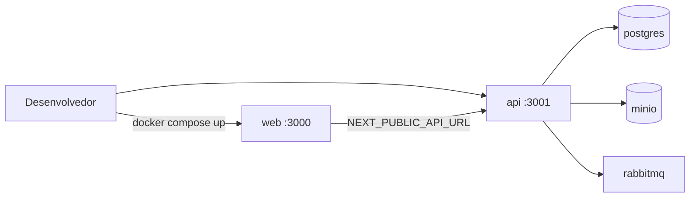

# US-002 — Ambiente Docker e health checks (implementação)

**Estado:** Concluída  
**Data de entrega:** 2026-10-01  
**Rastreio:** RFN-020, G-13  
**Persona:** P-ADM-S (administrador de sistema)

## O que foi entregue

Stack reprodutível no **Windows + Docker Desktop** com frontend (Next.js), backend (NestJS ApiBff), PostgreSQL 16, storage S3-compatible (MinIO/CloudServer dev), RabbitMQ e filas de jobs. Health probes HTTP na **raiz** do BFF (`/health`, `/ready`), fora do prefixo `/api/v1`.



## Início rápido

```powershell
cd c:\Users\dougl\OneDrive\Documents\Codes\ila-ead-ia
Copy-Item .env.example .env
docker compose up -d --build
curl.exe http://localhost:3001/health
curl.exe http://localhost:3001/ready
curl.exe http://localhost:3000/
```

Compose alternativo: `docker compose -f infrastructure/docker-compose.dev.yml --env-file .env up -d --build`

## Critérios de aceitação (validação)

| AC | Como validar |
|----|----------------|
| **AC 01** | Serviços `healthy` no Docker; `GET /health` → 200; `GET /ready` → 200 com Postgres + MinIO + RabbitMQ up |
| **AC 02** | `.env.example` documentado; `.gitignore` contém `.env` (teste automatizado em `testing/integration/us-002-ac02-env.spec.ts`) |

## Estrutura de código e infra

| Área | Caminhos principais |
|------|---------------------|
| **Compose raiz** | `docker-compose.yml` (include de `infrastructure/docker-compose.dev.yml`) |
| **API** | `apps/api/` — `HttpApiModule`, `HealthController`, `PrismaService`, `scripts/apply-data-migrations.mjs` |
| **Web** | `apps/web/` — `lib/api-config.ts`, homepage com probe de API |
| **Dockerfiles** | `infrastructure/dockerfiles/api.Dockerfile`, `web.Dockerfile` (context API = raiz do repo) |
| **DDL / migrações** | `data/migrations/*.sql`, tracking `schema_migrations` |
| **Env** | `.env.example`, `apps/web/.env.example`, `infrastructure/environments/.env.example` |
| **Testes** | `testing/unit/`, `testing/integration/us-002-*.spec.ts` |
| **Segurança** | `security/revisao-us-002-appsec.md` |
| **Revisão código** | `revision/2026-10-01-1025/` |

## Endpoints de health (ApiBff)

| Método | Path | Propósito | Corpo 200 |
|--------|------|-----------|-----------|
| GET | `/health` | Liveness (processo up) | `{ "status": "ok" }` |
| GET | `/ready` | Readiness | `{ "status": "ready", "checks": { ... } }` em dev; sem `checks` em produção |

Em falha de readiness: HTTP **503** com `ApiError` (`code`: `SERVICE_NOT_READY`, `message`, `correlationId`). Contrato: `technical/api-contracts/openapi.yaml`.

## Migrações de banco

1. **Initdb (primeiro volume):** Postgres monta `data/migrations/001_initial_schema.sql` em `docker-entrypoint-initdb.d`.
2. **Entrypoint da API:** aguarda Postgres, aplica SQL pendentes registrados em `schema_migrations` (`apps/api/scripts/apply-data-migrations.mjs`).
3. **Prisma:** bootstrap ORM + retry em `PrismaService`; modelo mínimo `AuthUser` em `apps/api/prisma/schema.sql`.

Comandos úteis:

```powershell
docker compose exec api npm run migrate:data
docker compose exec api npm run prisma:generate
```

## Variáveis críticas

| Variável | Onde | Notas |
|----------|------|--------|
| `DATABASE_URL` | api | Rede interna `postgres:5432` |
| `MINIO_*`, `RABBITMQ_URL` | api only | Nunca expostas ao browser |
| `NEXT_PUBLIC_API_URL` | web | Deve incluir `/api/v1` (ex.: `http://localhost:3001/api/v1`) |
| `API_PORT` / `WEB_PORT` | compose | Default **3001** / **3000** (doc US cita 4000 como exemplo OpenAPI) |

## Testes e qualidade

| Métrica | Valor |
|---------|--------|
| Testes automatizados US-002 | 13 (6 unit + 7 integração) |
| Relatório incremental | `testing/test-results.md` |
| Smoke rápido | `cd testing && npm run test:smoke-compose` |

## Revisões pós-implementação

- **Code review:** `revision/2026-10-01-1025/RELATORIO-UNIFICADO.md` — correções CON-001…012 em `CORRECOES-APLICADAS.md`
- **AppSec:** `security/revisao-us-002-appsec.md` — helmet, hardening migrações, MinIO interno em prod

## Próximas US dependentes

- **US-003** — OpenAPI/Swagger em runtime, CORS documentado
- **US-001+** — Auth JWT (usa `auth_users` já provisionado no schema inicial)

## Solução de problemas

| Sintoma | Causa provável | Ação |
|---------|----------------|------|
| API não sobe | `api_node_modules` desatualizado | `docker compose up -d --build api` |
| `/ready` 503 | MinIO/RabbitMQ down | `docker compose ps`; logs `minio`, `rabbitmq` |
| Web não chama API | `.env` sem `/api/v1` | Ajustar `NEXT_PUBLIC_API_URL`; ver `apps/web/lib/api-config.ts` |
| Schema ausente | Volume Postgres antigo | `migrate:data` ou recriar volume (ver `data/README.md`) |
