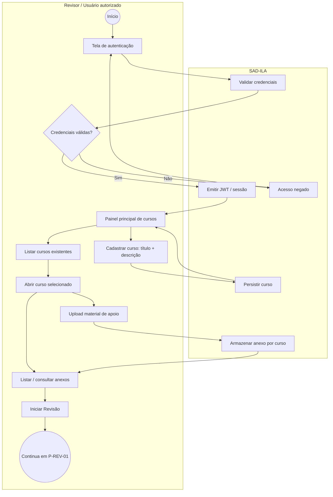

# BPMN — Gestão de cursos e materiais (To-Be MVP)

**Processos:** P-ACC-01, P-CUR-01/02, P-MAT-01, gatilho P-REV-01  
**RN:** RN-001 a RN-006, RN-004  

**Notas:** Provisionamento de usuários (P-TI-01) ocorre fora deste fluxo. SSO COMAER — evolução (lacuna).
