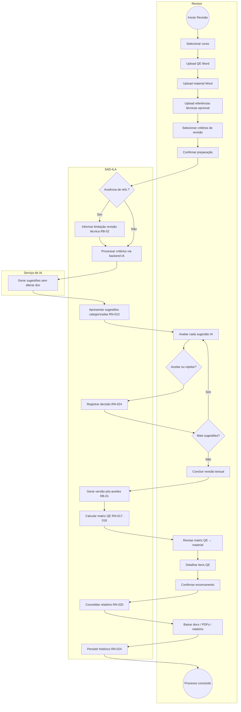

# BPMN — Revisão ponta a ponta (To-Be — Fase 3)

**Processos:** P-REV-01 → P-REV-04 → P-QE-01 → P-ENC-01 → P-GOV-01  
**RN:** RN-009–RN-025 | **RB:** RB-01–RB-05 | **Ordem:** RN-023  

**Subprocessos detalhados:** `04-human-in-the-loop-sugestoes-ia.md`, `05-conferencia-qe.md`, `06-escalonamento-especialista.md`.

**RB-03:** Critérios não selecionados não entram no relatório como concluídos.
