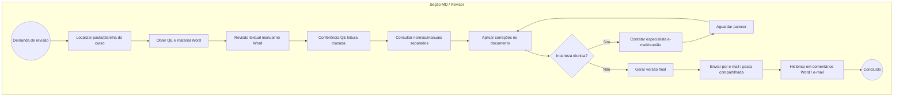

# BPMN — Revisão manual As-Is (macro)

**Status:** **Inferido** a partir de `product-vision.md`, `gap-analysis.md` — **validar com Seção MD (ILA)**.  
**Não representa BPM formal documentado** (lacuna G-11).

**Gargalos associados:** GAP-P01, GAP-P02, GAP-P05 (`improvement-opportunities.md`).
