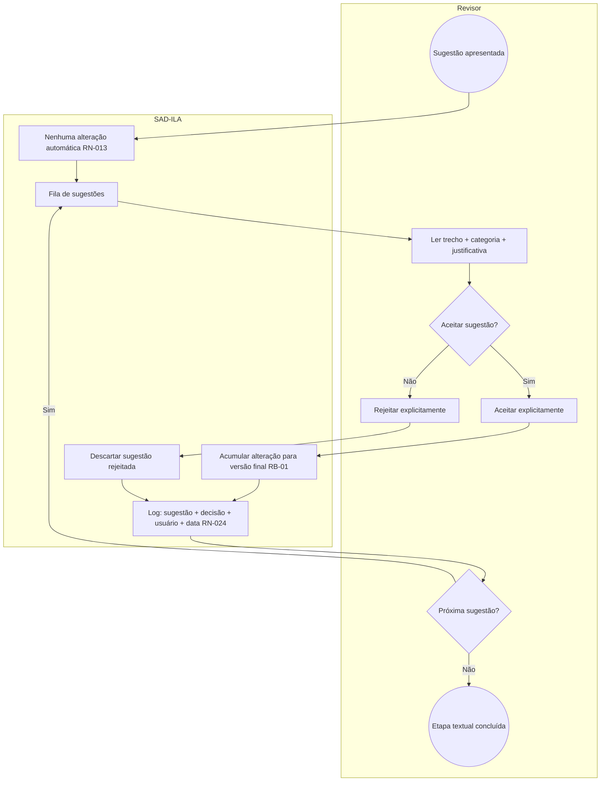

# BPMN — Subprocesso: decisão human-in-the-loop (sugestões IA)

**Processo:** P-REV-03  
**RN:** RN-013, RN-014, RN-015 | **RB:** RB-01  

**Regra:** Versão final `.docx` só reflete aceites (RN-021), nunca auto-aplicação da IA.
