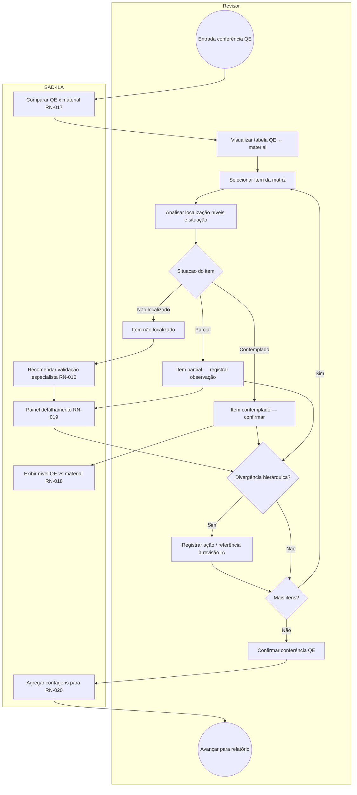

# BPMN — Conferência do Quadro Estrutural (QE)

**Processo:** P-QE-01  
**RN:** RN-017, RN-018, RN-019 | **Entrada:** pós P-REV-03 (RN-023)  

**Status possíveis (RN-017):** contemplado, cobertura parcial, não localizado.
