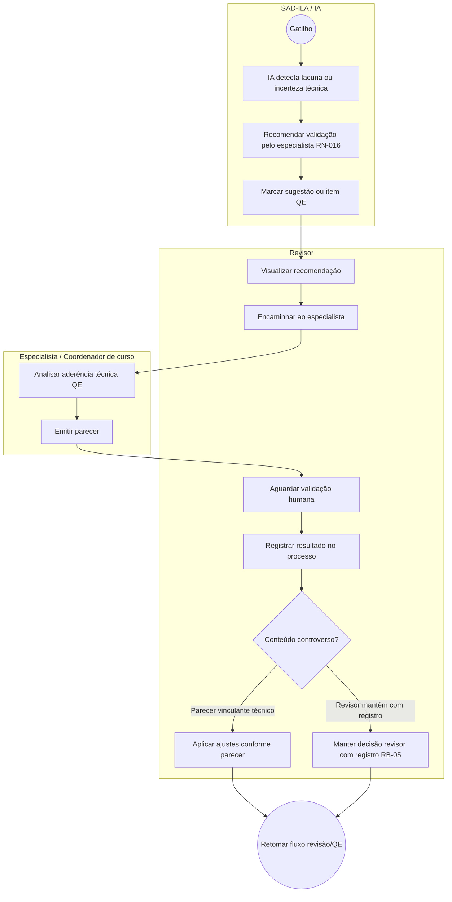

# BPMN — Escalonamento para especialista de conteúdo

**Processo:** P-REV-04  
**RN:** RN-016 | **RB:** RB-05  

**Notas:**

- IA **não substitui** o especialista (RN-016, RB-05).
- Canal de encaminhamento as-is: e-mail/reunião (**inferido**); To-Be deve registrar trilha (**detalhe funcional — Requirements Engineer**).
- Exemplos no protótipo: item QE “Penalidades contratuais — não localizado”; “Gestão de riscos — complementar com especialista”.
