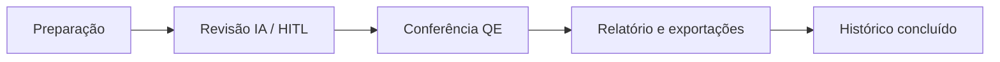

# Especificação de Requisitos de Software (SRS) — SAD-ILA

**Padrão de referência:** IEEE 830 (estrutura adaptada)  
**Versão:** 1.0  
**Data:** 2026-10-01  
**Projeto:** 26SISIAR05LOG  

**Documentos derivados detalhados:**

- `functional-requirements.md`
- `non-functional-requirements.md`
- `requirements-traceability-matrix.md`
- `user-stories-ready-for-dev.md`

---

## 1. Introdução

### 1.1 Propósito

Este SRS descreve requisitos funcionais e não funcionais do **SAD-ILA** (Sistema de Apoio ao Desenvolvimento de Material Didático) para orientar arquitetura, implementação, testes e aceite pelo ILA/COMGAP.

### 1.2 Escopo

**Incluído (visão alvo por fases):**

- Plataforma web com autenticação, gestão de cursos e materiais, processo de revisão com IA (human-in-the-loop), conferência QE, relatórios/exportações e histórico auditável.

**Excluído v1:**

- LMS completo, SSO COMAER (evolução), publicação automática sem validação humana, edição colaborativa em tempo real.

Referência: `business/product-vision.md` §3.

### 1.3 Definições, acrônimos e abreviações

| Termo | Significado |
|-------|-------------|
| **ILA** | Instituto de Logística da Aeronáutica |
| **COMGAP** | Comando-Geral de Apoio |
| **COMAER** | Comando da Aeronáutica |
| **QE** | Quadro Estrutural |
| **BFF** | Backend for Frontend — API única consumida pelo frontend |
| **JWT** | JSON Web Token |
| **HITL** | Human-in-the-loop — decisão humana por sugestão |
| **RN** | Requisito de negócio |
| **RF / RFN** | Requisito funcional / não funcional |

### 1.4 Referências

| Documento | Caminho |
|-----------|---------|
| Visão do produto | `business/product-vision.md` |
| Requisitos de negócio | `business/business-requirements.md` |
| Gap analysis | `business/gap-analysis.md` |
| Stakeholders | `business/stakeholder-matrix.md` |
| Mapa de processos | `processes/process-map.md` |
| Processos críticos | `processes/critical-processes-matrix.md` |
| Diretrizes técnicas | `TODOs.md` |
| Protótipo UX | `others_artifacts/sad-ila-prototype 1.3.html` |

### 1.5 Visão geral do documento

- Seção 2: contexto e usuários.
- Seção 3: requisitos específicos (resumo; detalhe nos artefatos RF/RFN).
- Seção 4: apêndices e rastreabilidade.

---

## 2. Descrição geral

### 2.1 Perspectiva do produto

O SAD-ILA é sistema **web** composto por:

1. **Frontend** — interface responsiva; consome apenas API REST autenticada; não persiste documentos localmente.
2. **Backend (BFF)** — regras de negócio, persistência, storage de arquivos, **proxy** para serviço de IA.
3. **Persistência** — banco relacional (usuários/auth, cursos, processos, trilha de auditoria).
4. **Storage de objetos** — arquivos Word/PDF/uploads.
5. **Serviço de IA** — externo ou on-prem; acessado somente pelo backend.

Implantação alvo: **containers Docker** (desenvolvimento via Docker Desktop no Windows).

### 2.2 Funções do produto (sumário)

| # | Função | RF principais |
|---|--------|---------------|
| F1 | Autenticação e autorização | RF-001–005 |
| F2 | Catálogo de cursos | RF-010–012 |
| F3 | Materiais de apoio | RF-020–022 |
| F4 | Preparação de revisão | RF-030–035 |
| F5 | Revisão assistida por IA | RF-040–044, RF-090–091 |
| F6 | Conferência QE | RF-050–053 |
| F7 | Relatórios e exportações | RF-060–063 |
| F8 | Histórico e auditoria | RF-070–071 |
| F9 | Experiência institucional | RF-080–081 |

### 2.3 Características dos usuários

| Persona | Competência | Uso principal |
|---------|-------------|---------------|
| Revisor / elaborador | Alta em QE e normas ILA | Fluxo completo de revisão |
| Coordenador / especialista | Validador técnico | Itens QE críticos, flags RN-016 |
| Gestor material didático | Supervisão | Histórico, indicadores (evolução) |
| Admin cursos | Cadastro | Cursos e materiais |
| Admin sistema (TI) | Técnica | Usuários, operação |

### 2.4 Restrições

- Human-in-the-loop obrigatório (RB-01).
- Segredos e chaves de IA fora do código-fonte (RN-007).
- JWT entre frontend e backend (RN-008).
- Ambiente containerizado (regra de projeto).
- Decisão **G-09** (dados/IA) bloqueia uso de IA em produção com material real até aprovação.

### 2.5 Suposições e dependências

- Word (`.docx`) como formato padrão de QE e material.
- Provedor de IA adequado ao português técnico-administrativo disponível no piloto.
- Infraestrutura COMGAP para hospedagem, backup e monitoramento.
- Revisores capacitados para interpretar sugestões de IA.

---

## 3. Requisitos específicos

### 3.1 Requisitos funcionais

Lista completa e critérios: **`functional-requirements.md`** (RF-001 a RF-091, RF-W01–W04).

**Fluxo mandatório (RN-023):**

### 3.2 Requisitos não funcionais

Lista completa: **`non-functional-requirements.md`**.

Destaques Must:

- RFN-001 segredos; RFN-002 JWT; RFN-003 hash senha; RFN-004 RBAC; RFN-005 uploads; RFN-006 CORS; RFN-020 Docker; RFN-040 OpenAPI; RFN-041 BFF; RFN-060 HITL.

### 3.3 Requisitos de interface

**Externas:**

- UI web responsiva (RF-080); referência visual protótipo 1.3 (RF-081).
- API REST JSON + OpenAPI 3; autenticação Bearer JWT.

**Internas:**

- Integração IA: REST/gRPC conforme provedor — encapsulada no backend (RF-090).

**Páginas previstas (RFN-050):**

| Rota | Função |
|------|--------|
| `/login` | Autenticação |
| `/cursos` | Painel principal |
| `/cursos/[id]` | Hub curso + materiais |
| `/revisao/novo` ou modal | Entrada preparação |
| `/revisao/[processoId]/preparacao` | Wizard preparação |
| `/revisao/[processoId]/sugestoes` | HITL |
| `/revisao/[processoId]/qe` | Matriz QE |
| `/revisao/[processoId]/relatorio` | Encerramento |
| `/historico` | Consulta processos |
| `/admin/usuarios` | Provisionamento (TI) |

### 3.4 Requisitos de performance

Ver RFN-010, RFN-011. Metas numéricas finais dependem de validação V-05 e baseline M-01.

### 3.5 Requisitos de segurança

Ver RFN-001–008, RFN-060. Workshop obrigatório V-02, V-03 antes de piloto com dados sensíveis.

---

## 4. Apêndices

### 4.1 Glossário estendido

- **Processo de revisão:** instância de fluxo vinculada a um curso, arquivos e critérios, com estados (`rascunho`, `preparacao_concluida`, `revisao_ia`, `qe`, `relatorio`, `concluido`).
- **Sugestão:** proposta da IA sobre trecho do material; estados `pendente`, `aceita`, `rejeitada`.

### 4.2 Matriz de rastreabilidade

Ver **`requirements-traceability-matrix.md`**.

### 4.3 Priorização e backlog

Ver **`prioritized-backlog.md`** e **`user-stories-ready-for-dev.md`**.

### 4.4 Histórico de revisões do SRS

| Versão | Data | Autor | Notas |
|--------|------|-------|-------|
| 1.0 | 2026-10-01 | Requirements Engineer (agente) | Versão inicial a partir de business + processes |
