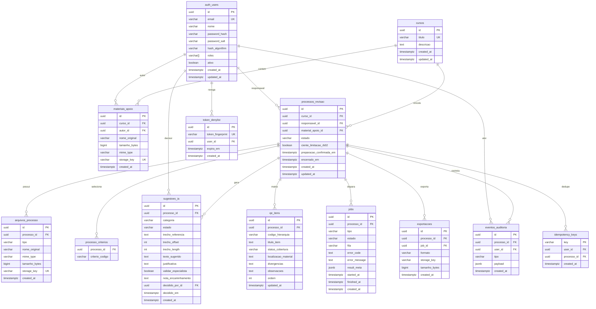

# Modelo de dados (ERD) — SAD-ILA

**Versão:** 1.0  
**Data:** 2026-10-01  
**SGBD:** PostgreSQL 15+  
**DDL executável:** `data/migrations/001_initial_schema.sql` (espelho: `schema.sql`)  
**Rastreio:** RFN-003, RFN-005, RF-070, ADR-004, ADR-007, ADR-010  

---

## 1. Diagrama lógico

---

## 2. Enumerações

### `processos_revisao.estado`

`rascunho`, `preparacao_concluida`, `revisao_ia`, `qe`, `relatorio`, `concluido`

### `arquivos_processo.tipo`

`qe`, `material`, `referencia`

### `sugestoes_ia.estado`

`pendente`, `aceita`, `rejeitada`

### `sugestoes_ia.categoria`

`melhoria`, `correcao_necessaria`, `ajuste_hierarquia`, `validar_especialista`

### `qe_itens.status_cobertura`

`contemplado`, `cobertura_parcial`, `nao_localizado`

### `processo_criterios.criterio_codigo`

`coerencia_coesao`, `linguagem_dialogica`, `ortografia_gramatica`, `consistencia_terminologica`, `subordinacao_hierarquica`, `conferencia_qe`, `revisao_tecnica_normativa`

### `jobs.tipo` / `jobs.estado`

Tipos: `revisao_ia`, `export_docx`, `export_pdf`  
Estados: `queued`, `running`, `succeeded`, `failed`

---

## 3. Regras de integridade

| Regra | Implementação |
|-------|----------------|
| Título curso único | `UNIQUE (titulo)` em `cursos` |
| Append-only auditoria | Sem UPDATE/DELETE na app; trigger opcional deny UPDATE |
| Originais imutáveis | Sem UPDATE em `storage_key` de arquivos_processo após insert |
| HITL export | Relatórios leem sugestões `aceita` apenas (aplicação) |
| FK processo → curso | ON DELETE RESTRICT |
| Papéis | Array PostgreSQL `varchar[]` ou tabela N:N Could — v1 array |

---

## 4. Índices (resumo)

Ver `schema.sql`. Principais:

- `processos_revisao (curso_id, estado, created_at DESC)`
- `eventos_auditoria (processo_id, created_at)`
- `sugestoes_ia (processo_id, estado)`
- `jobs (processo_id, created_at DESC)`
- `materiais_apoio (curso_id, created_at DESC)`

---

## 5. Autenticação e tokens

- **auth_users:** credenciais isoladas (RFN-003).
- **token_denylist (Should):** revogação logout; limpeza job por `expira_em`.
- **Refresh tokens:** não modelados v1.

---

## 6. Normalização

- Catálogo (`cursos`, `materiais_apoio`) separado de instâncias de fluxo (`processos_revisao`).
- Critérios N:N via `processo_criterios` (PK composta).
- Jobs e exportações desnormalizam `storage_key` para download rápido.

---

## Histórico

| Versão | Data |
|--------|------|
| 1.0 | 2026-10-01 |
