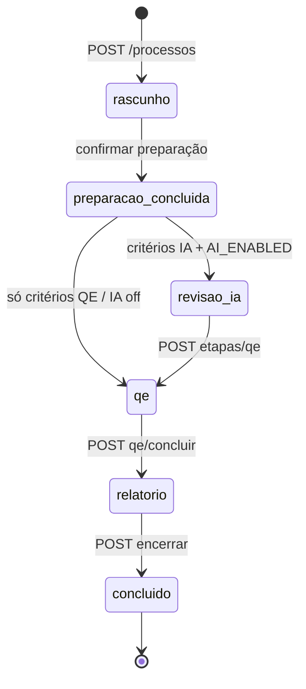

# Especificações técnicas detalhadas — SAD-ILA

**Versão:** 1.0  
**Data:** 2026-10-01  
**Projeto:** 26SISIAR05LOG  
**Arquitetura de referência:** `architecture/architecture-document.md` (Alternativa A — monólito modular NestJS BFF)  
**Contratos:** `technical/api-contracts/openapi.yaml` (fonte da verdade)  
**Modelo de dados:** `technical/data-models/`  

**Rastreio:** RF-001–091, RFN-001–060, US-001–041  

---

## 1. Visão geral

O **ApiBff** é um monólito modular NestJS que expõe REST JSON em `/api/v1`, consome PostgreSQL (transacional + auditoria), MinIO (objetos), RabbitMQ (jobs) e Provedor IA (somente via **IaFacade**). O frontend Next.js **nunca** acessa MinIO, RabbitMQ ou Ollama diretamente.

| Artefato | Caminho publicação |
|----------|-------------------|
| OpenAPI YAML | Repositório: `technical/api-contracts/openapi.yaml` |
| Swagger UI | Runtime: `/api/docs` (NestJS; restringir em produção — RFN-006) |
| OpenAPI JSON | Runtime: `/api/docs-json` (padrão `@nestjs/swagger`) |

Ambiente de desenvolvimento: **Windows + Docker Desktop**; build/npm/npx no contêiner correspondente (`.cursor/rules/ambiente.mdc`).

---

## 2. Stack e convenções de código

| Tema | Decisão |
|------|---------|
| Linguagem | TypeScript strict |
| Backend | NestJS 10+ (módulos por domínio) |
| ORM | **Prisma** ou **TypeORM** (implementação escolhe um; schemas em `schema.sql` são lógicos) |
| Validação HTTP | `class-validator` + `class-transformer` nos DTOs |
| IDs | UUID v4 (`uuid`) em API e PKs |
| Datas | `timestamptz` UTC no banco; ISO-8601 na API |
| Erros | `ApiError { code, message, correlationId }` — ver OpenAPI |
| Logs | JSON; `correlationId` por request (RFN-042 Should) |
| Testes | Jest (unit/integração); contrato alinhado ao OpenAPI |

**Camadas por módulo (SAD §5.5):**

```
Controller → ApplicationService → Domain / Ports → Repository / Adapters
```

- Controllers **finos**: guards, DTO, status HTTP.
- Regras de negócio e máquina de estados em **ApplicationService** do módulo dono.
- Entidades de persistência ≠ DTOs de API.

**Nomenclatura:**

- Módulos Nest: `AuthModule`, `ProcessoRevisaoModule`, etc.
- Filas AMQP: `revisao.ia`, `export.documento` (duráveis).
- Prefixos MinIO: `cursos/{cursoId}/`, `processos/{processoId}/` (ADR-011).

---

## 3. Módulo HttpApi

**Responsabilidade:** bootstrap global, roteamento `/api/v1`, CORS, OpenAPI, health, filtros de exceção, interceptors (correlationId), limites de body.

| Endpoint | Fora de `/api/v1` | US |
|----------|-------------------|-----|
| `GET /health` | sim | US-002 |
| `GET /ready` | sim | US-002 |

**CORS (RFN-006):**

| Ambiente | `CORS_ORIGINS` (exemplo) | Credenciais |
|----------|--------------------------|-------------|
| dev (Compose) | `http://localhost:3000` | `true` (se cookies futuros); v1 usa Bearer no header |
| piloto | URL(s) do WebApp COMGAP | idem |
| produção | lista explícita; **sem** `*` com credenciais | idem |

Headers permitidos: `Authorization`, `Content-Type`, `Idempotency-Key`, `X-Correlation-Id`.

**Limites RFN-010:**

- `MAX_UPLOAD_MB` (default **50**) — middleware + validação Storage.
- Timeout proxy upload: **≥ 120s** para 20 MB (config reverse proxy / Nest body parser).
- Listagens: paginação obrigatória; índices conforme `schema.sql`.

**Ready probe:** Postgres **Must** up; RabbitMQ e MinIO **Should** (503 se down — documentado em OpenAPI).

---

## 4. Módulo Auth (RF-001–004, RFN-002–003)

**Responsabilidade:** login, emissão JWT, logout, `/me`, denylist opcional.

**Tabela:** `auth_users` (isolada — RFN-003, ADR-006).

**Hash v1 (ADR-007):**

```
password_hash = SHA256( salt || plaintext || PASSWORD_PEPPER )
```

- `salt`: 16+ bytes aleatórios, armazenado por usuário.
- Comparação **constant-time**.
- Campo `hash_algorithm = 'sha256_v1'` para migração futura Argon2id.

**JWT:**

| Claim | Conteúdo |
|-------|----------|
| `sub` | UUID do usuário |
| `email` | e-mail |
| `roles` | array `revisor` \| `admin_cursos` \| `admin_sistema` |
| `iat`, `exp` | padrão JWT |

- Algoritmo: `JWT_ALGORITHM` (HS256 default dev; RS256 Could em prod).
- TTL: `JWT_EXPIRES_IN` default **8h** (RFN-002).
- **Refresh token:** ausente v1 (ADR-006 Could v1.1); re-login após expiração.

**Logout (RF-004):**

- Cliente descarta token.
- **Denylist (Should):** tabela `token_denylist` com `jti` ou hash do token + `exp`; checada no `JwtAuthGuard` para tokens ainda válidos por `exp` mas revogados.
- Recomendado habilitar denylist para `admin_sistema` sempre; demais papéis Could.

**Login:** resposta **401** genérica para credenciais inválidas (RF-001); sem enumeração de e-mail.

**Dependências:** PostgreSQL apenas; Users delega persistência de perfil à mesma tabela ou view — **v1:** Users CRUD opera `auth_users` via Auth/Users services compartilhando repositório.

---

## 5. Módulo Users (RF-005, US-006)

**Responsabilidade:** provisionamento `admin_sistema` — listagem, criação, PATCH (nome, papéis, `ativo`).

- Senha inicial: hash via AuthService; nunca retornada.
- Desativar: `ativo = false` → login rejeitado **401**.
- RBAC: somente `admin_sistema`.

---

## 6. Módulo Cursos (RF-010–012, US-008–010)

**Responsabilidade:** CRUD catálogo, hub agregado (resumo materiais/processos).

- Título **único** (constraint DB → **409** `CURSO_TITULO_DUPLICADO`).
- POST/PATCH: `admin_cursos` ou `admin_sistema`.
- GET: qualquer autenticado.
- Limites de tamanho título/descrição via env (`CURSO_TITULO_MAX`, `CURSO_DESCRICAO_MAX`).

---

## 7. Módulo Materiais (RF-020–021, US-011–012)

**Responsabilidade:** metadados de apoio por curso; upload/download via Storage.

### Decisão técnica: upload por revisor

| Operação | `revisor` | `admin_cursos` | `admin_sistema` |
|----------|-----------|----------------|-----------------|
| GET lista / metadados / download | sim | sim | sim |
| POST upload | **sim** (Should institucional) | sim | sim |
| DELETE material | não v1 | Could | Could |

**Justificativa:** no piloto, revisores/elaboradores produzem material com frequência maior que admins de catálogo; RF-020 não restringe papel; RBAC mínimo mantém **escrita de curso** só para `admin_cursos+` (RF-011). Upload continua auditável (`material_apoio_criado`).

**Fluxo upload:** multipart → validação MIME (`.docx`, `.pdf`) → stream BFF → MinIO `cursos/{cursoId}/materiais/{uuid}` → insert `materiais_apoio`.

---

## 8. Módulo ProcessoRevisao (RF-022, RF-030–035, US-013, US-020–024)

**Responsabilidade:** instância do fluxo, wizard preparação, arquivos do processo, critérios, confirmação (facade entrypoint), transições de estado.

### 8.1 Máquina de estados (RN-023, SAD §5.4)

Estados persistidos em `processos_revisao.estado`:

| Estado | Descrição |
|--------|-----------|
| `rascunho` | Wizard em edição |
| `preparacao_concluida` | Confirmado; aguardando IA ou salto |
| `revisao_ia` | Job IA em curso ou HITL pendente |
| `qe` | Conferência estrutural |
| `relatorio` | Pós-QE; export/encerramento |
| `concluido` | Terminal; imutável (RF-063) |



**Transições:** apenas via métodos explícitos do ApplicationService; PATCH preparação **não** avança estado sozinho.

**Idempotência:** `POST /processos` aceita header `Idempotency-Key` (Should RFN-041) — tabela ou cache 24h `(user_id, key) → processo_id`.

### 8.2 Preparação

- `PATCH .../preparacao`: cursoId, critérios (array enum), metadados wizard.
- `POST .../arquivos`: tipo `qe` | `material` | `referencia`; originais **imutáveis** (RN-024).
- `POST .../preparacao/confirmar`:
  - Valida RF-031 (qe + material presentes).
  - RF-033: ≥1 critério.
  - RF-034: se `revisao_tecnica_normativa` sem referências → body exige `cienteLimitacao: true`.
  - Transação ACID: update estado, insert critérios, auditoria.
  - Se critérios exigem IA textual **e** `AI_ENABLED=true` → publica job → **202** + `jobId`; senão **200** e vai para `qe` ou `preparacao_concluida` conforme matriz abaixo.

| Critérios selecionados | AI_ENABLED | Próximo estado | HTTP confirmar |
|----------------------|------------|----------------|----------------|
| Qualquer IA textual* | true | `revisao_ia` | 202 + job |
| Qualquer IA textual* | false | `qe` ou bloqueio UX** | 200 + aviso `AI_DISABLED` |
| Apenas QE / hierarquia | — | `qe` | 200 |

\* IA textual: coerência, linguagem dialógica, ortografia, terminologia (não inclui só `conferencia_qe` isolado).  
\*\* Produto: mensagem institucional G-09; processo continua para QE (decisão alinhada SAD §5.3 gate).

### 8.3 DTOs principais (API)

Ver OpenAPI `ProcessoCreate`, `PreparacaoPatch`, `ConfirmarPreparacaoRequest`, `ProcessoDetalhe`.

---

## 9. Módulo IaFacade (RF-090–091, ADR-008)

**Responsabilidade:** adapter `IaProvider`, prompts, timeout, circuit breaker, mapeamento → `SugestaoDraft[]`.

**Interface interna:**

```typescript
interface IaProvider {
  analisarMaterial(input: IaAnaliseInput): Promise<SugestaoDraft[]>;
}
```

**Input (não exposto ao browser):** texto extraído (trechos), critérios, ids processo, referências resumidas — **sem** log de texto integral.

**Ollama v1:** `POST {AI_PROVIDER_BASE_URL}/api/chat` (ou equivalente documentado no adapter).

| Env | Default |
|-----|---------|
| `AI_ENABLED` | `false` prod; `true` dev profile |
| `AI_REQUEST_TIMEOUT_MS` | `180000` |
| Circuit breaker | N falhas consecutivas → open 60s; retorna erro recuperável |

**Não persiste** decisões HITL; Jobs chama Facade e grava sugestões via ProcessoRevisao repository.

---

## 10. Módulo Jobs (ADR-009)

**Responsabilidade:** publish/consume AMQP no **mesmo processo** NestJS.

| Fila | Payload | Consumer |
|------|---------|----------|
| `revisao.ia` | `{ jobId, processoId }` | extrai texto → IaFacade → insert sugestões → job succeeded/failed |
| `export.documento` | `{ jobId, exportacaoId, tipo: docx\|pdf }` | RelatoriosService gera arquivo → MinIO |

**Prefetch:** 1–2 (env `RABBITMQ_PREFETCH`).

**Retry:** backoff exponencial max 3; dead-letter Could v1.1.

**API:** `GET /jobs/{id}` — estados `queued`, `running`, `succeeded`, `failed` + `errorCode` opcional.

**POST `/processos/{id}/ia/retry`:** RBAC revisor+; **403/422** `AI_DISABLED` se flag off.

---

## 11. Módulo QeConferencia (RF-050–053, US-030–032)

**Responsabilidade:** parse inicial do `.docx` QE (job ou sync na confirmação — **implementação:** parse na confirmação ou primeiro GET matriz), matriz `qe_itens`, PATCH item, conclusão.

**Status item:** `contemplado`, `cobertura_parcial`, `nao_localizado`.

**POST qe/concluir:** estado processo → `relatorio`; auditoria `qe_concluida`.

---

## 12. Módulo Relatorios (RF-060–063, US-034–036)

**Responsabilidade:** agregado JSON relatório; enfileira export; **HITL:** docx aplica **somente** sugestões `aceita` (RFN-060).

- `POST exportacoes/docx|pdf` → 202 + job.
- `GET exportacoes/{id}/download` → stream via Storage.
- `POST encerrar` → `concluido`; rejeita mutações subsequentes **409**.

---

## 13. Módulo Storage (ADR-005, ADR-011)

**Responsabilidade:** cliente S3 (MinIO), validação MIME/extensão, keys UUID, downloads autenticados.

- Bucket único `MINIO_BUCKET`; isolamento por prefixo + RBAC no BFF.
- **413** se tamanho > `MAX_UPLOAD_MB`.
- Anti-malware: Could (RFN-005); v1 MIME + extensão.

---

## 14. Módulo Auditoria (RF-070–071, ADR-010)

**Responsabilidade:** `eventos_auditoria` **append-only** (sem UPDATE/DELETE na aplicação).

Tipos exemplo: `processo_criado`, `preparacao_confirmada`, `ia_iniciada`, `ia_concluida`, `ia_falha`, `sugestao_decidida`, `qe_concluida`, `exportacao_gerada`, `processo_encerrado`.

Payload JSONB resumido — sem corpo integral Word.

---

## 15. Feature flag G-09 / `AI_ENABLED`

| Valor | Comportamento |
|-------|---------------|
| `false` | Não publica `revisao.ia`; retry IA **403/422**; UI mensagem institucional |
| `true` | RF-040 habilitado após decisão G-09 registrada |

Registrar decisão institucional: Could tabela `config_sistema` ou env apenas — **v1:** env no deploy; documentar mudança via DevOps.

---

## 16. Segurança transversal

- RBAC guard em toda rota mutável e download (RFN-004).
- JWT guard global exceto login e health.
- Rate limit: Could (429 reservado no OpenAPI).
- Secrets: somente env containers (RFN-001).

---

## 17. Rastreabilidade módulo ↔ RF/US

| Módulo | RF | US (amostra) |
|--------|-----|--------------|
| HttpApi | RFN-006, RFN-021 | US-002, US-003 |
| Auth | RF-001–004 | US-001, US-004 |
| Users | RF-005 | US-006 |
| Cursos | RF-010–012 | US-008–010 |
| Materiais | RF-020–021 | US-011–012 |
| ProcessoRevisao | RF-022, RF-030–035, RF-044 | US-013, US-020–024, US-028 |
| IaFacade, Jobs | RF-040–041, RF-090–091 | US-025–026 |
| Sugestões (HTTP) | RF-042–043 | US-027, US-029 |
| QeConferencia | RF-050–053 | US-030–032 |
| Relatorios | RF-060–063 | US-034–036 |
| Auditoria | RF-070–071 | US-037–038 |

---

## 18. Lacunas remanescentes (não inventadas)

- **G-09 / V-03:** provedor produção e DPA — flag only v1.
- **V-02:** classificação sigilo — impacto payload IA.
- **V-05:** confirmar `MAX_UPLOAD_MB` com TI.
- **M-01:** SLA IA numérico.
- **Refresh token** v1.1 se 8h insuficiente.
- **Argon2id** antes produção institucional (ADR-007).

---

## Histórico

| Versão | Data | Notas |
|--------|------|-------|
| 1.0 | 2026-10-01 | Especificação inicial pós-SAD |
