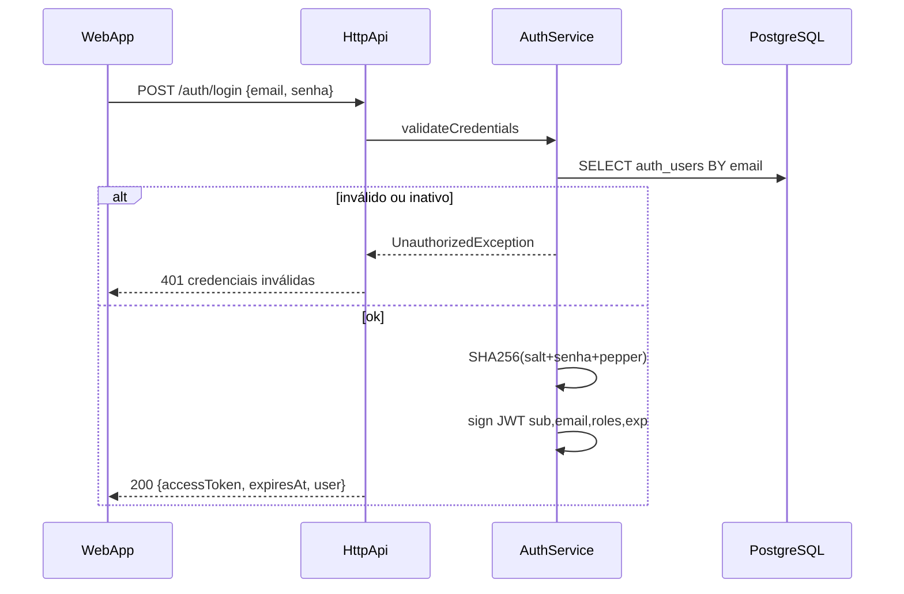
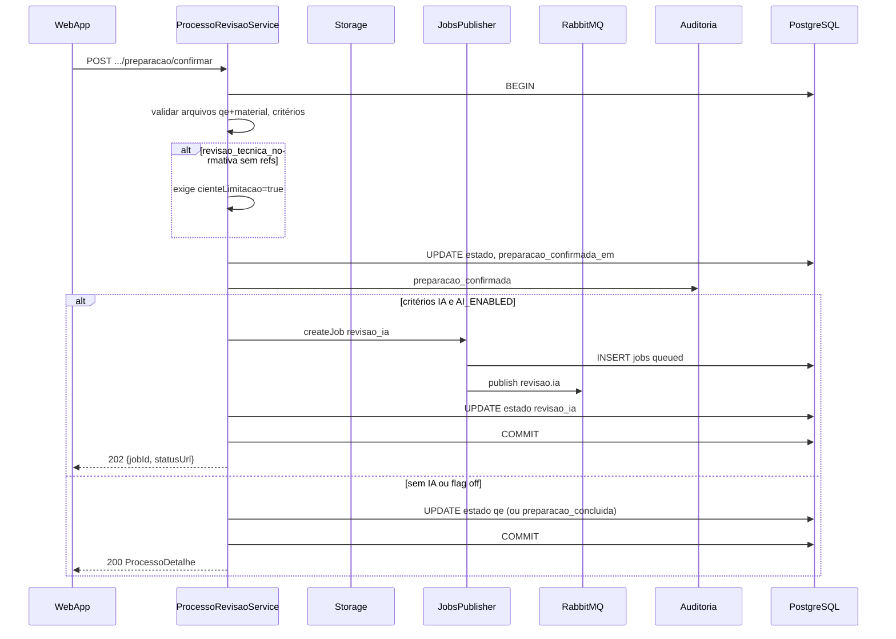
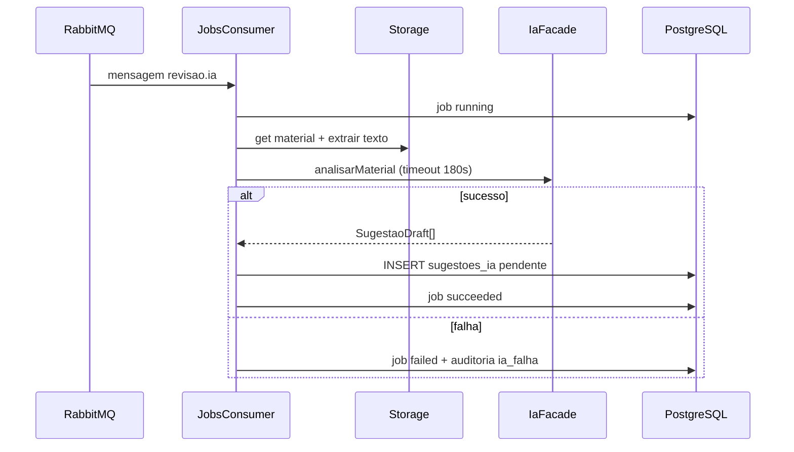
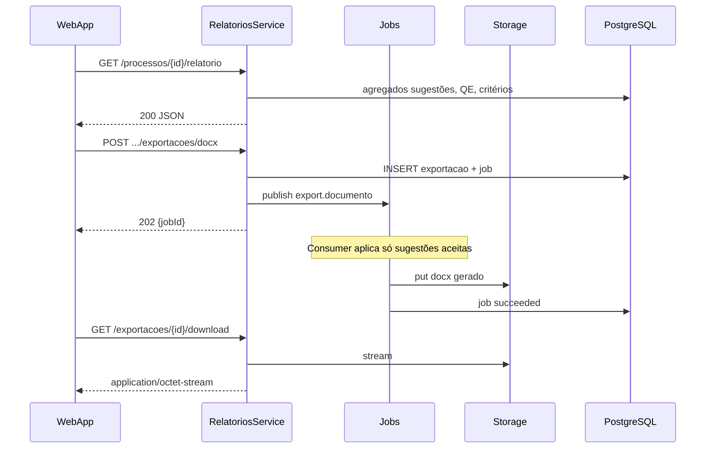

# Casos de uso técnicos — SAD-ILA

**Versão:** 1.0  
**Data:** 2026-10-01  
**Rastreio:** RF-001–091, US-001–041  

Documento descreve fluxos técnicos ponta a ponta: componentes, transações, idempotência e erros. Contratos HTTP: `technical/api-contracts/openapi.yaml`.

---

## UC-T01 — Login e sessão JWT

**RF:** RF-001, RF-002 | **US:** US-001  

### Fluxo

### Regras

- Resposta 401 **genérica** (sem “e-mail não encontrado”).
- TTL default 8h; sem refresh v1.
- Próximas requests: `Authorization: Bearer`.

### Erros

| Código | code |
|--------|------|
| 400 | `VALIDATION_ERROR` |
| 401 | `AUTH_INVALID_CREDENTIALS` |

---

## UC-T02 — Logout e denylist (Should)

**RF:** RF-004 | **US:** US-004  

1. Cliente chama `POST /auth/logout` com JWT válido.
2. AuthService calcula fingerprint (hash do token ou `jti`) e insere `token_denylist` com `expira_em = exp` do JWT.
3. Retorna **204**.
4. `JwtAuthGuard` rejeita token na denylist com **401** `TOKEN_REVOKED`.

---

## UC-T03 — Wizard preparação (rascunho)

**RF:** RF-030–033, RF-031–032 | **US:** US-020–023  

### Passos técnicos

1. `POST /processos` → 201, estado `rascunho` (opcional `Idempotency-Key`).
2. `PATCH /processos/{id}/preparacao` — critérios, cursoId.
3. `POST /processos/{id}/arquivos` (multipart) — tipos `qe`, `material`, `referencia` (múltiplas referências).
4. Storage: stream → MinIO; insert `arquivos_processo`.
5. Auditoria: `arquivo_anexado`.

### Transação

Cada upload: transação curta (metadados PG + put MinIO); rollback PG se put falhar; orphan object cleanup job Could.

### Erros

| HTTP | Situação |
|------|----------|
| 413 | `UPLOAD_TOO_LARGE` |
| 400 | MIME inválido |
| 409 | Processo `concluido` |

---

## UC-T04 — Confirmar preparação (Facade BFF)

**RF:** RF-034, RF-035 | **US:** US-024  

### Idempotência

Segunda confirmação com estado ≠ `rascunho` → **409** `ESTADO_INVALIDO`.

### RF-034

Body `{ "cienteLimitacao": true }` obrigatório quando critério normativo sem referências; senão **422** `RB02_CIENTE_OBRIGATORIO`.

---

## UC-T05 — Job IA e polling (HITL)

**RF:** RF-040–041, RF-090–091 | **US:** US-025–026  

### Consumer (mesmo processo NestJS)

### Polling

`GET /jobs/{jobId}` até `succeeded` | `failed`.  
UI navega para `/sugestoes` quando succeeded.

### Retry RF-091

`POST /processos/{id}/ia/retry` → novo job se estado recuperável e sem sugestões pendentes bloqueando política interna.

### G-09

`AI_ENABLED=false` → retry **422** `AI_DISABLED`.

---

## UC-T06 — Decisão HITL sugestão

**RF:** RF-042–043 | **US:** US-027, US-029  

1. `POST /sugestoes/{id}/decisao` body `{ decisao, comentario? }`.
2. Transação: update `sugestoes_ia` se `pendente`; set `decidido_por_id`, `decidido_em`.
3. Se repetir mesma decisão → **200** (idempotente).
4. Se mudar decisão após decidida → **409** `SUGESTAO_JA_DECIDIDA` (v1 imutável).
5. Auditoria `sugestao_decidida`.
6. `PATCH /sugestoes/{id}/especialista` — flag e nota (RF-043).

**HITL (RFN-060):** export posterior lê apenas `aceita`.

---

## UC-T07 — Avanço para QE

**RF:** RF-044 | **US:** US-028  

1. `POST /processos/{id}/etapas/qe`.
2. Valida estado `revisao_ia`.
3. Conta sugestões `pendente` → se > 0 **422** `SUGESTOES_PENDENTES`.
4. Update estado `qe`; parse/popula `qe_itens` se ainda vazio.
5. Auditoria `etapa_qe_iniciada`.

---

## UC-T08 — Conferência QE e conclusão

**RF:** RF-050–053 | **US:** US-030–032  

- `GET /processos/{id}/qe/matriz` — join `qe_itens`.
- `PATCH .../qe/itens/{itemId}` — update campos RF-052.
- `POST .../qe/concluir` — estado → `relatorio`; **422** se itens obrigatórios incompletos (regra configurável MVP: todos com status ≠ default Could).

---

## UC-T09 — Relatório e export docx/pdf

**RF:** RF-060–062 | **US:** US-034–036  

### ACID

Geração docx: leitura consistente snapshot sugestões `aceita` no início do job.

---

## UC-T10 — Encerramento processo

**RF:** RF-063 | **US:** US-036  

1. `POST /processos/{id}/encerrar` — estado `relatorio` → `concluido`, `encerrado_em`.
2. Mutations subsequentes **409**.
3. Auditoria `processo_encerrado`.

---

## UC-T11 — Histórico e auditoria

**RF:** RF-070–071 | **US:** US-037–038  

- `GET /processos?cursoId=&estado=` paginado.
- `GET /processos/{id}/eventos` — SELECT append-only `eventos_auditoria`.

---

## UC-T12 — Health e readiness

**US:** US-002  

| Rota | Critério |
|------|----------|
| `/health` | Processo Node responde |
| `/ready` | `SELECT 1` Postgres; Should ping MinIO + RabbitMQ |

Falha ready → orquestrador não roteia tráfego (**503** em balanceador).

---

## Matriz transações ACID

| UC | Escopo transacional |
|----|------------------------|
| T04 confirmar | UPDATE processo + critérios + job + auditoria |
| T06 decisão | UPDATE sugestão + auditoria |
| T07 avanço QE | UPDATE processo + auditoria |
| T10 encerrar | UPDATE processo + auditoria |
| Upload | Metadados PG; MinIO fora de TX 2PC — compensação manual |

---

## Histórico

| Versão | Data |
|--------|------|
| 1.0 | 2026-10-01 |
